# .NET Core tools in Visual Studio 2017

<p align="center">
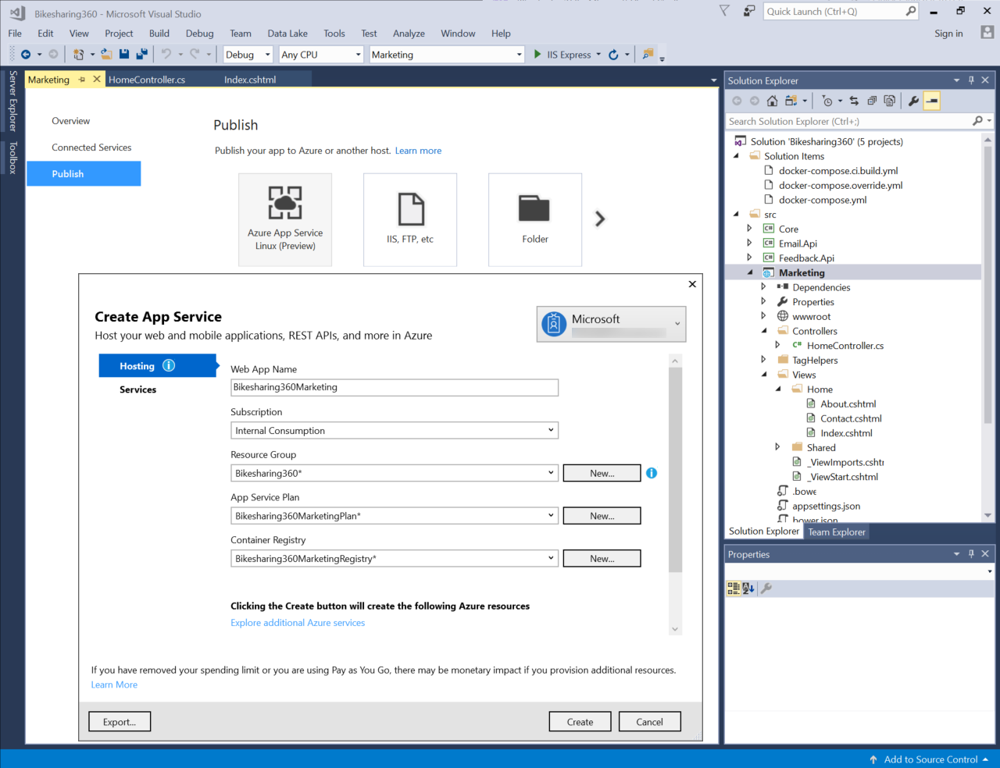
</p>


**Setup:**

- Visual Studio 2017 

- Make sure the error list is unpinned / hidden.

- You can start with any project.json-based ASP.NET Core web application. If you don’t have one, just mention the migration and create a new ASP.NET Core App Project by clicking New
option in the File Menu.

**Demo steps**

1. Open Visual Studio 2017. Notice that no solution is open.

   > **Talking Point**:
     We released .NET Core runtime and framework 1.0 last June and 1.1 in November. The runtime and framework were production ready, but the tooling was in preview and has gone through a couple of iterations since. With Visual Studio 2017, I’m happy to announce we have released the first version of the dotnet core tools! For those of you that started building .NET Core apps with our preview tooling, we thank you for your patience. We now have a final 1.0 release!
     These tools are based on a project system that is consistent with the rest of .NET that works with MSBuild.
     Preview tools worked with a project.json format that people liked because it was easy to edit, but it wasn’t consistent with the project system and build technology of the rest of .NET. With the release of the tools we’ve got the best of both worlds.

1. Open a project.json-based solution

2. Click OK

   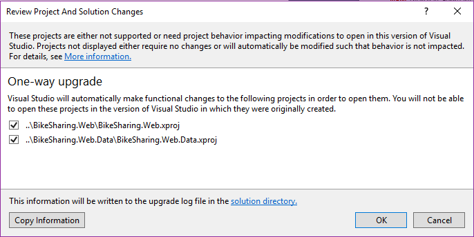

   > **Talking Point**: 
     First off, Visual Studio 2017 makes it very easy to bring in your previously built .NET Core projects with the preview tooling and migrate them for you. Let’s migrate an ASP.NET Core web project I had built with Visual Studio 2015. As you can see I get a standard project migration dialog when I open the project which will take a backup and migrate your solution.

3. Open project file. Right-click on project in Solution Explorer, select **Edit BikeSharing.Web.csproj**

   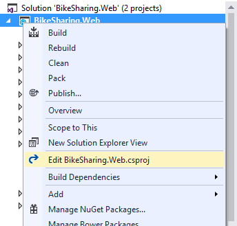

   > **Talking Point**:
     So what did the migration do exactly? All it did was take the project information in the previous project.json format and transform it into the new csproj format. Let’s take a look at it.


4. Scroll through the file, noting how significantly smaller it is.

   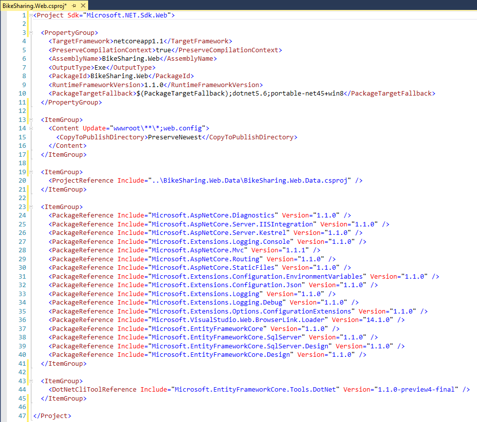

   > **Talking Point**:
     Notice when I say new format, I mean the NOT SUPER SCARY HUMAN
     UNREADABLE format. Notice we have no more GUIDS, Hint paths, no more listing each file individually that should be included! Any file we put in our solution folder will be picked up automatically.

5. Point out the new **References** section – now called **Dependencies** and how it groups them.

6. Expand **Projects** and **SDK** nodes as well.

7. Highlight Project reference node.

   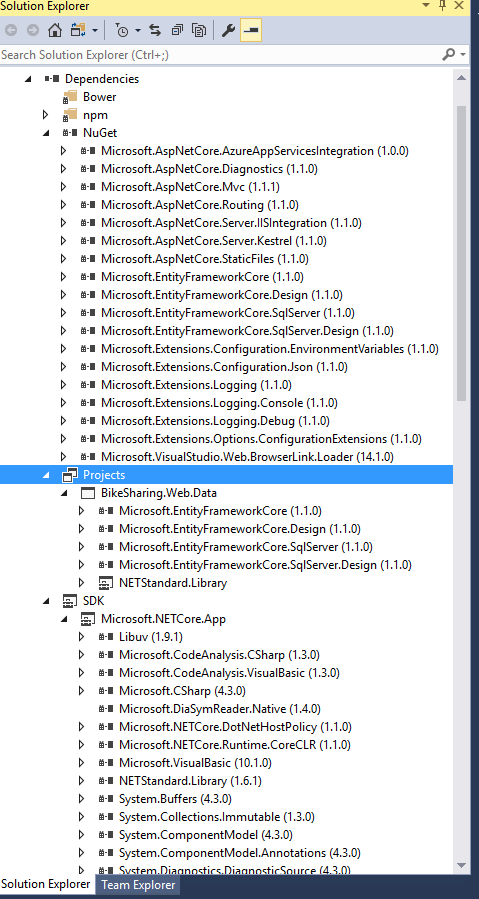

   > **Talking Point**: 
     Notice that our references are grouped a lot nicer here in the Solution Explorer too. We can now easily tell the difference between package references, project references and framework references.I should also mention that this data library project reference is using Entity Framework Core which is based on the .NET Standard library. The .NET Standard library defines a common API surface area across .NET implementation and makes our library portable. This means we could reference this from other project types, such as Xamarin, WPF, Unity or UWP, not just .NET Core projects.


8. In Solution Explorer, highlight the Dependencies / NuGet

   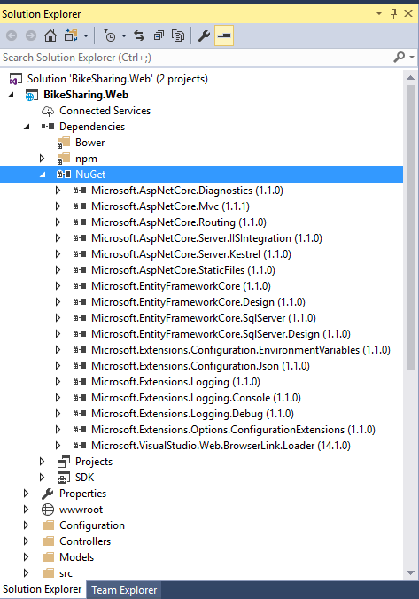

   > **Talking Point**:  
     This is a great new UI but you don’t need to use it if we prefer to stay in the “CODE ZONE”. We can edit the csproj directly. Keep your eye on the NuGet packages node in solution explorer as I edit the csproj.

9. Remove a package reference (Ctrl+X). Save (Ctrl+S)

   

   > **Talking Point**:
     Goodbye package.


10. Add the package back in (Ctrl+V)

11. Save (Ctrl+S)

    

    > **Talking Point**:
     …and add it back again which triggers the package restore. You see that Visual Studio always stays in sync. Say goodbye to reloading the project when we change the csproj! WHOOO HOOOO

12. Right-click on dependencies and select Manage NuGet Packages

    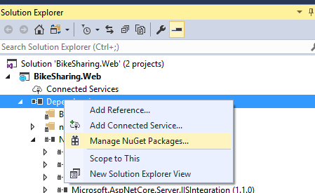

    > **Talking Point**:  
      This gives us the flexibility of using the editor or the UI to make project-level changes. As you can see we still have our NuGet UI.

13. Select BROWSE

14. Start typing **ApplicationInsights.Asp**

    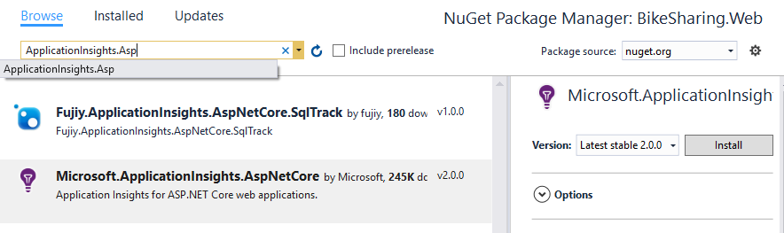

    > **Talking Point**:  
    I could add packages just like before of course.
    Say I’m looking at adding Application Insights to my ASP.NET Core app. This capability is new in ASP.NET Core. Application Insights provides powerful monitoring and diagnostics telemetry, plus the tooling to analyze it all. Typically, you can just install a package and start using it in your code, but this one it takes a little more work to add
    the instrumentation. Thankfully Visual Studio is here to help! Instead of manually installing the package here and configuring all the pieces, Visual Studio can do all of this for me with a much better experience than previous versions.

15. Add Connected Service

    

    > **Talking Point**: 
      I can just add a Connected Service and select Monitoring with Application Insights.

16. Click "*Monitoring with Application Insights*”

    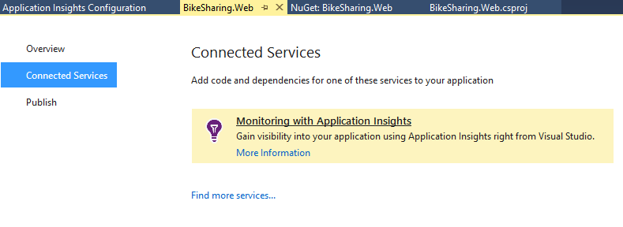

    > **Talking Point**: 
      The Connected Services experience in Visual Studio helps me add code *and* all the dependencies I need to get me quickly get up and running.

17. Click **Start Free**

    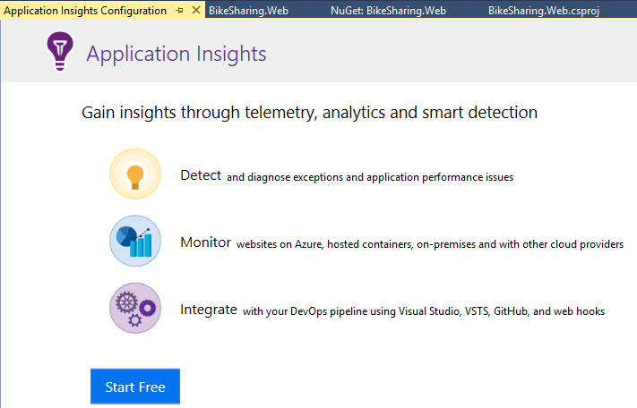

    > **Talking Point**:  
      For Application Insights, we can choose to set up the data collection in Azure for free.

**Point out the settings.**

18. Scroll down and mention you can also do this locally.

    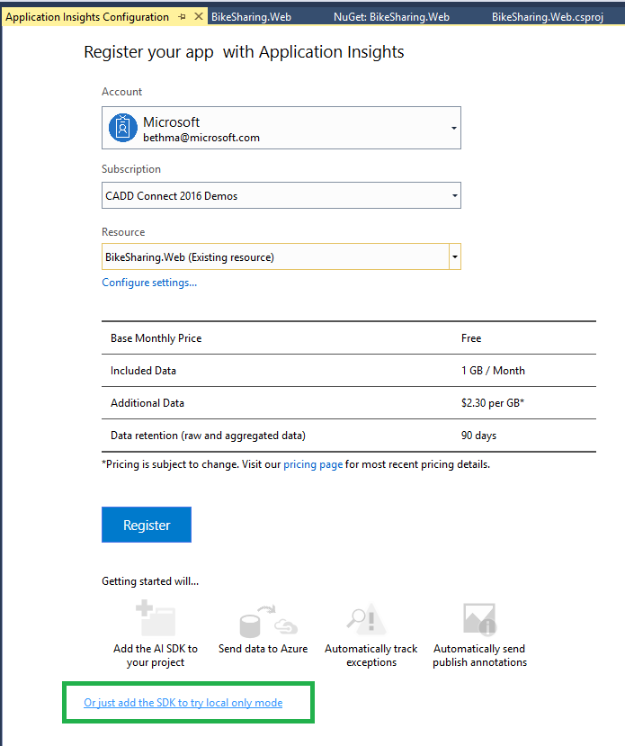

    > **Talking Point**:
      Here is where I specify my Azure subscription details and can see what’s included. Notice that I don’t have to use Azure, I can also use App Insights in a local-only mode that will show me telemetry when debugging locally.


19. Select Resource drop-down, point out you can create a new Resource, but is better to select existing resource so you can have some data collected once you get to this point.

    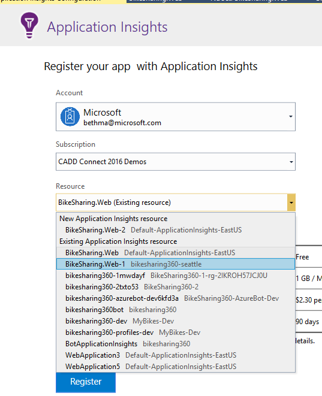

    > **Talking Point**:  
      Here Visual Studio can set up a new resource. However, I’m going to add this to an existing resource that’s attached to a copy of this app that I’ve already published so you can see some telemetry that’s been collecting there.

20. Click Register.

    > **Talking Point**:  
      Now it’s setting up my telemetry resources in Azure by automatically adding the NuGet package, the scripts, and necessary code and configuration that I need. Then it will be ready to start collecting events. There are a bunch of events that will automatically collect and you can also add your own custom events as well.


21. Open Program.cs, add code to line 19.

    ```
    \`\`\` .UseApplicationInsignts() \`\`\`
    ```

    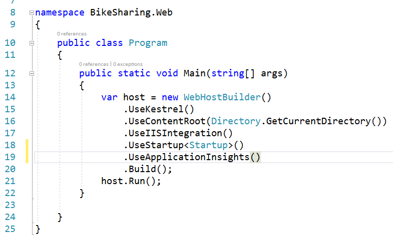

    > **Talking Point**:  
      Last thing we need to do is make sure we add a line of code to the ASP.NET middleware pipeline.


22. Right-click, **publish**

    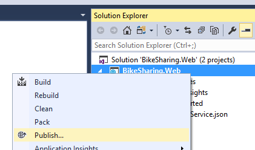

    > **Talking Point**:  
      Of course, I will want to deploy this app in order to start collecting real events.


23. Click the arrow and scroll through the list of choices.

24. Select **Existing App Service**

25. Click **Publish**

    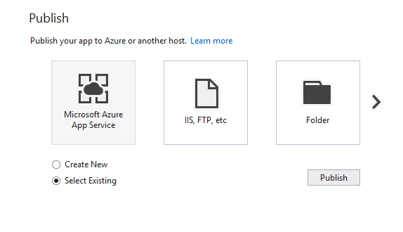

    > **Talking Point**:  
      Notice we have a new publish experience and more choices to publish to. We can choose to publish this to Azure app service,which we can use for easily hosting web-based services and applications, IIS, a folder, we can even publish to a Virtual Machine right from here.


26. Select the app service you want to deploy to.

27. Click **OK**

    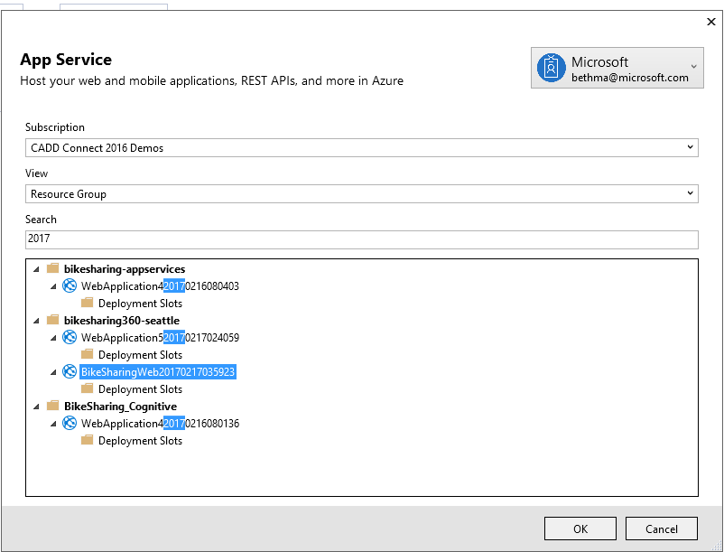

    > **Talking Point**:  
      I’m going to select an existing App Service. This will kick off a release build (which is cool I didn’t have to remember that myself) and publish our application for us.Once it’s finished, we can see it in our browser.

28. Hit refresh a couple times to generate some recent requests.

    > **Talking Point**:  
      Let’s create some recent events by hitting the website.

29. Click on Application Insights button.

    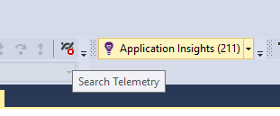

    > **Talking Point**:  
      Now we’ll jump back to Visual Studio. Notice I have a button up here in the toolbar for Application Insights.

30. Change time range to “Last 3 Days”

31. Double-click one of the requests to show the properties.

    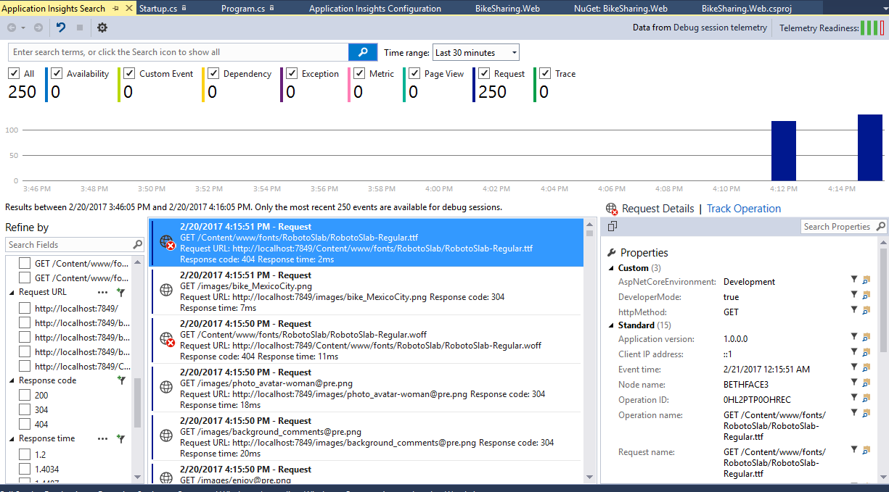

    > **Talking Point**:  
      Here you can see the requests that it collected and we can drill into the details to see a bunch of information about the event like the operation, response time, codes, etc.

32. Scroll down and show how you can create an issue right here in VSTS

    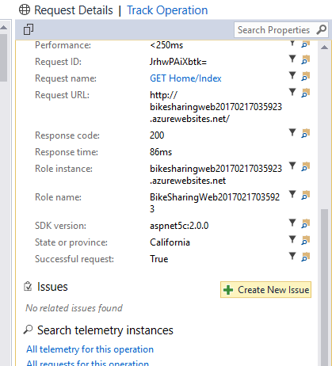

    > **Talking Point**:  
      And look, I can create and track issues in Visual Studio Team Services RIGHT HERE. Amazing!

    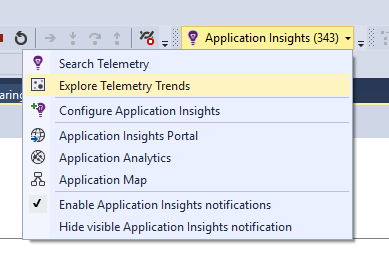

    > **Talking Point**:  
      As we start to get a lot more information, we need a powerful way to look at the trends.

    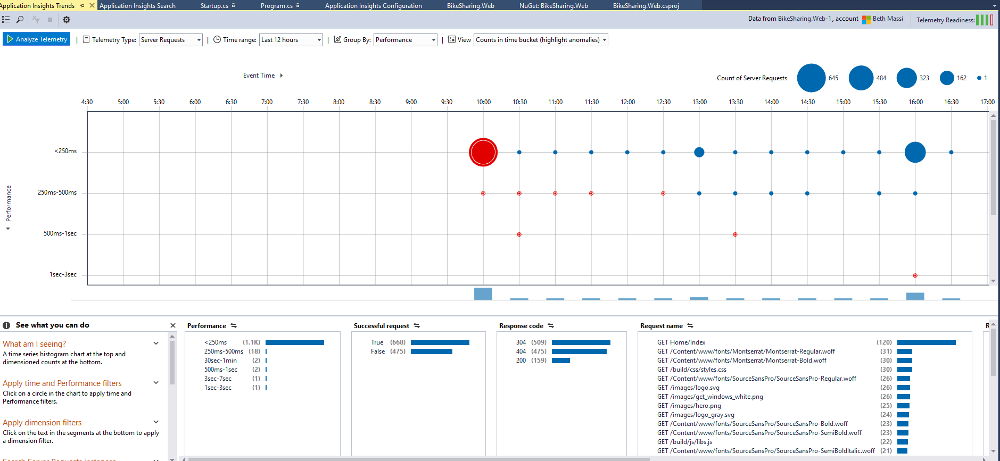

    > **Talking Point**:  
    Here we can start analyzing the trends, pinpointing issues, and learning how users are using our site. Notice that this points out anomalies as well, like in this case, performance degradation.Of course, this is all available in the Azure portal too. And you can also write your own queries to analyze the telemetry in interesting ways. As you can see, Visual Studio makes all this super simple to set up, not
    just for .NET Core apps but for any app. Why are you not using this on your apps today?! Go download Visual Studio 2017 now!
