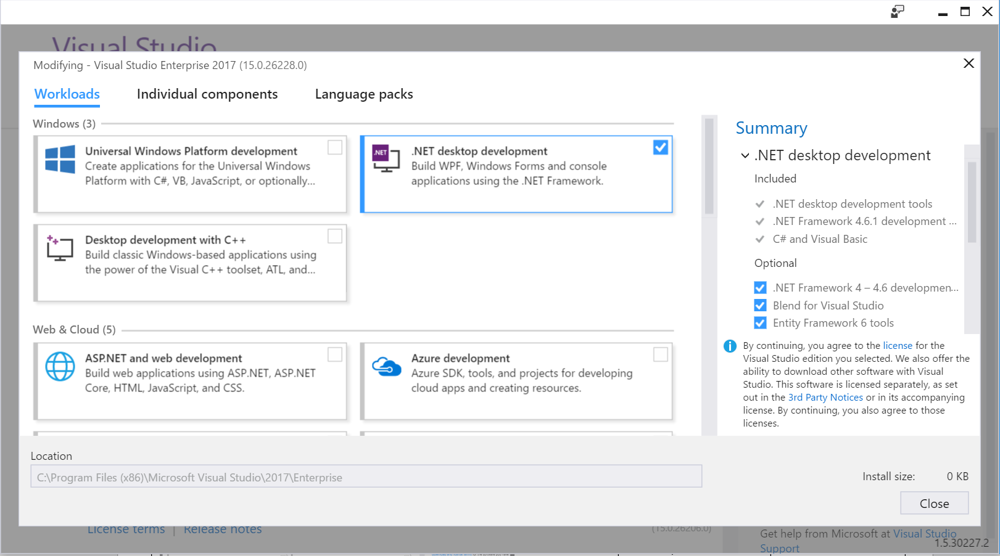
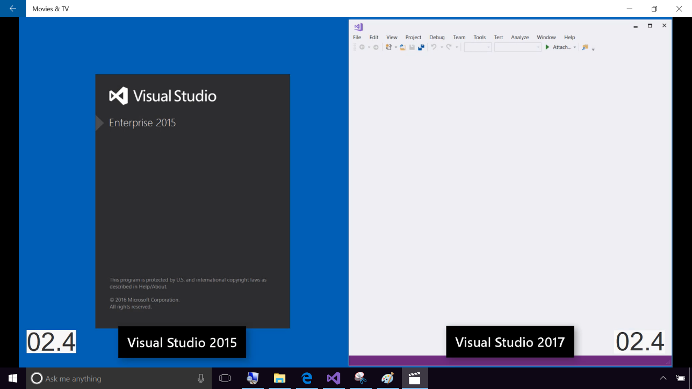
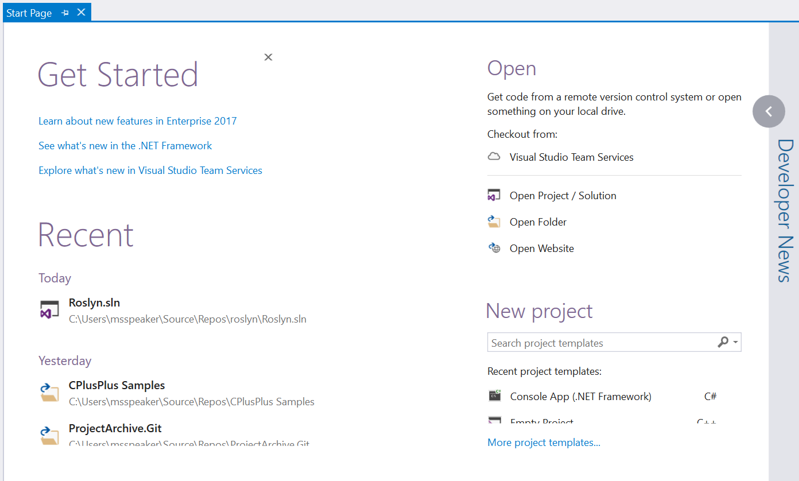
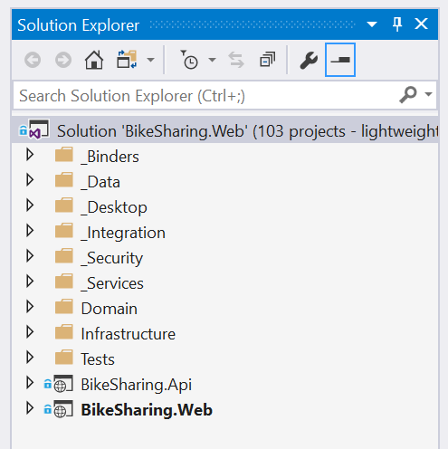

# Visual Studio 2017 RTM - Installation and better performance

# Prerequisites

## Setup/Necessary Bits

-   A machine with Visual Studio 2017 Installer and Enterprise Installed

-   Video of side by side performance of Visual Studio 2015 Visual Studio  Visual Studio 2017

## Install Experience/Onboarding

-   Installer with workloads

-   Side by Side Perf Improvements

-   Start Page Recent lists Roam

-   Open Connect From Visual Studio TS /Clone

-   Lightweight Solution Load

-   Call to Action to Download 2017

## Demo Steps

### Show the new installer

1. Open the Visual Studio Installer. Click *Modify* on the Enterprise Install. Point
out that the “core” Visual Studio installation is small and you select only the workloads you need.

> **Talking Point**:     
As Visual Studio 2017 is now released, many of you will be picking up Visual Studio 2017 for
the first time. Let's look at how easy it is to get you up and running.  We have broken down Visual Studio into 16 workloads, like a menu for your IDE so you can quickly order up which type of app development you are interested in and only install what you use.  The options range from .NET Desktop to Linux development with C++ with many choices in between.

### Show Performance of Startup

1.  Play the video. Show the Side by Side performance improvement of how fast Visual Studio  opens
    and loads a Solution. Notice how fast Visual Studio 2017 opens and that you can search in
    the solution faster than in 2015!

2.  Video shows launching Roslyn solution in 2 seconds, the solution loading in 10 –12
    seconds, and proof that the solution loaded by searching it in 14 seconds. File
    opens in 18 seconds.

> **Talking Point**:  
Now that we have Visual Studio  installed,it is time to open it. Opening Visual Studio is the
first step to getting productive. We have made performance improvements that
will save you the most precious of time - startup time. I have a video example
here of opening the Roslyn Solution with over 100 projects in it. On the left of the image is Visual Studio 2015 and on the right, is the new and improved Visual Studio  2017.   Notice at 2 seconds Visual Studio 2015 is still spinning while Visual Studio  2017 is already open. At 12 second mark, the solution is loaded and by 18th second, we can start using it whereas Visual Studio  2015 still has a long way to go.  
We want to empower you to Get in, and Get going.

### Point out the new start page

1.  Open Visual Studio 2017

When you have the extension installed, the GitHub provider should show up
under <i>Open</i>.

> **Talking Point**:  
Well let's back up for a second. How did I get that code in the first place?
(switch to 2017) I started at the Start Page. You have a Recent section with
your recent projects and solutions list. And when you sign into Visual Studio , projects
that are connected to source control in the cloud, will travel with you. So you
can find it in the list and start the checkout process with one click.

1.  On the Start Screen, click on the <i>Visual Studio Team Services</i> item under Open - Checkout from: A
    dialog should popup to search.

> **Talking Point**:  
If I don't have my project already in the Recent List, I need to grab it from my
team’s source control. Here under “Open”, you’ll see we have a new “Checkout
from:” section. In this section, I can go ahead and click to clone my Repo from
Visual Studio Team Services.

I just search for the repo I need and hit clone. I am working on the bike
sharing360Productivity app that will be used in the rest of the demos. I hear
BikeSharing360 is becoming so popular that they are expanding to multiple new
cities including Seattle.

### Lightweight Solution Load

1.  Enable Lightweight Solution Load from Tools Options.

2. Open a large solution.

> **Talking Point**:  
Now that I have my solution, let's open it. A coworker warned me this one has a
lot of projects to load so I enabled Lightweight Solution Load ahead of time.
With this enabled, look at how quick my 100 projects loaded.

Getting you productive means helping you not sweat the small stuff and by
improving our performance of things you do every day we are saving you valuable
time so you focus on the code.

But before anything else, Step 0 in becoming more productive is going to
VisualStudio.com and installing Visual Studio 2017 today!