# Microservices and Docker

<p align="center">
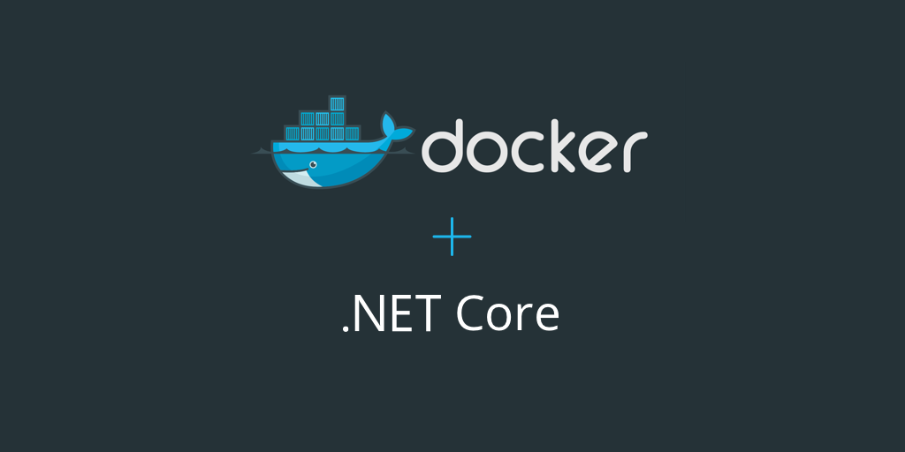
</p>

<a href="https://channel9.msdn.com/Events/Connect/2016/Keynotes-Scott-Guthrie-and-Scott-Hanselman" >Reference links</a>


## Demo Overview

High-level flow

-  Ease of which you can build, iterate, debug and publish single docker container services

-  Ease of which you can build, iterate, debug multi-container, polyglot services.

-  With the complexity of multi-container workloads, Visual Studio
    aides in the configuration of CI/CD using Visual Studio Team
    Services, deployed to Azure Container service.

## Rough Outline

**Single Container Workload**

-  Open an existing project

-  Add Docker Support to run within a docker container

-  F5 – your app directly into Docker Containers

-  Make a change, while the app is running demonstrating the same
        productivity VS developers have come to expect, even while
        running in a Docker Container

-  Once happy with the app, you can easily and quickly publish
        directly to **App Service/Web Apps** as a Docker Container, using
        the Azure Container Registry

**Multi Container Workload**

-  Open an existing multi-project solution that **the team** has been
        working on

-  The project has a mix of <a href="https://www.microsoft.com/net/core#windowsvs2017">.NET Core apps</a> and other services
        written in other languages, by other teams

-  The .NET Projects are loaded in the solution providing
        multi-container development and debugging. The other services
        are **container references**, meaning developers can instance them
        as containers without having to build them equivalent to a .NET
        Binary reference

-  Debug the collection of service. VS will instance the .NET Core
        projects, with the debugger hooked, while the **binary/container**
        images are also instanced giving a full experience.

-  Using the new Visual Studio configure CI/CD gesture, we can
        configure VSTS and the new Azure Container Registry for a
        multi-environment DevOps workflow. This sets up the team for
        automation from the start.

## Key Takeaways

The three things viewers should take away from this section/demo will
be:

1. <a href="https://docs.docker.com/engine/userguide/storagedriver/imagesandcontainers/">Containers</a> are becoming the new unit of deployment. <a href="https://docs.microsoft.com/en-us/azure/app-service/app-service-value-prop-what-is">App Services</a> is our latest container deployment model.

2. <a href="https://www.visualstudio.com/">Visual Studio</a> adopts the containerization model of developing and debugging your services in containers.

3. Visual Studio and Azure provide end to end developer to production services, From single container services in App Services to
    configuring CI/CD for multi-container workloads managed in ACS

## Subtle theme

Although the demos are deployed as **Linux containers**, the flows are not
Linux unique. The reference to Linux will/can be made, but the
expectation should set the same experiences that exist on Windows. We
have Windows Container/Full FX inner loop experiences available at
**Visual Studio 2017 RTM**. Configuring CI/CD to a Windows Docker host will
come in a Visual Studio update this summer.

## Demo Bits and licenses

- <a href="https://docs.docker.com/docker-for-windows/" >Docker For Windows</a>

- Install <a href="https://download.docker.com/win/beta/InstallDocker.msi" >from here</a>

## Linux Container Demos

Configure Shared Drives

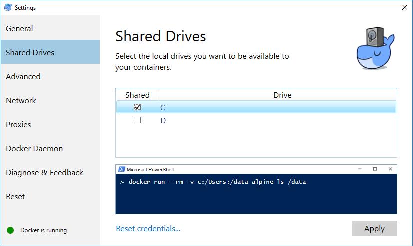

## Cache Docker Images

docker pull microsoft/aspnetcore:1.1

docker pull microsoft/aspnetcore:1.0

docker pull microsoft/aspnetcore-build:1.0-1.1

## Install the az CLI

1. Install <a href="https://github.com/Azure/azure-cli/blob/master/doc/preview_install_guide.md#windows-cmd" >guide</a>

2. To install Python, use <a href="https://www.python.org/ftp/python/3.5.2/python-3.5.2-amd64-webinstall.exe" >Windows x86-64 web-based installer </a>
        
3. Check **Add Python 3.5 to PATH**

4. Add **%userprofile%\\AppData\\Roaming\\Python\\Python35\\Scripts** to the system path


### Create a Container Registry in the Azure Portal

<a href="https://docs.microsoft.com/en-us/azure/container-registry/container-registry-get-started-portal">From here</a>

### Create a Container Registry with the Azure CLI

<a href="https://docs.microsoft.com/en-us/azure/container-registry/container-registry-get-started-azure-cli">From here</a>

### Optional: Configure DC/OS Viewing

<a href="https://docs.microsoft.com/en-us/azure/container-service/container-service-connect" >From here</a>

## Create a Container Registry in Azure

1. Create a **Resource Group** for the Registry 
   
   ```
   az resource group create -n bikesharing-acr -l southcentralus
   ```

2. Create a **registry**

   ```
   az acr create --name bikesharing --location southcentralus --resource-group bikesharing-acr --enable-admin
   ```

3. Create a **service principal** for the **username/password**

   ```
   az ad sp create-for-rbac --scopes /subscriptions/\[SUBSCRITION\_ID\]/resourcegroups/bikesharing-acr/providers/Microsoft.ContainerRegistry/registries/bikesharing
   --role Owner --password <PASSWORD>
   
   ```

4. **Login** to the new registry

   ```
    docker login <URL> -u <USERNAME> -p <PASSWORD>
   
   ```

## Create an Azure Container Service

1. Create a **Resource Group** for the Container Service

   ```
    az resource group create -n bikesharing-acs -l southcentralus
   
   ```

2. Create the **Container Service**

   ``` 
    az acs create --dns-prefix bikesharing -n bikesharing -g bikesharing-acs -l southcentralus

   ```

## Optional: Install Putty 

Used for accessing the ACS deployed site. Not part of the core demo.

<a href="http://www.chiark.greenend.org.uk/~sgtatham/putty/download.html" >From here</a>

- use the **.ssh** folder provided

- run **pageant** from the start menu. It will appear in the bottom right

  **systray**

- Add a key, using the context menu

  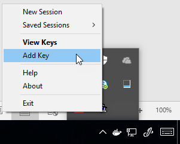

- Import the **id\_rsa.ppk** from the **%userprofile%\\.ssh** folder. This will provide access to browse deployed **ACS apps** from the marathon UI 

## Visual Studio Configuration

- Install <a href="https://www.visualstudio.com/">Visual Studio 2017</a>

- Add the Continuous Delivery Extension <a href="http://aka.ms/cd4vs" >from here</a>

## Enable Track Active Item

For the multi-container demo, to highlight which project is being actively debugged, it helps to turn on active item tracking

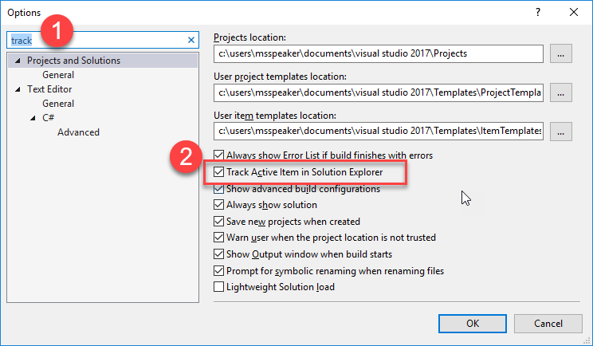

## Sample Projects

1. <a href="https://github.com/SteveLasker/Bikesharing360-Single/" >BikeSharing360-Single</a>

2. <a href="https://github.com/SteveLasker/Bikesharing360-Multi/" >BikeSharing360-Multi</a>

Place the Multi-container project under VSTS source control prior to the VSTS demo as configure CI/CD will only work if already under VSTS Git

## Demo 1 Setup

- Clone projects

- Open the Single Container project

- **CTRL+F5** to start the app under IIS Express

- Warm up Publish UI

- Collapse all folders

## Demo 1: Intro demo scenario E2E demo

**Scenario**: We need a marketing site for our new campaign. The campaign will hopefully go big, so we’ll need an easy way to scale it up. It’s a single container app, so we can start with a simple yet robust hosting model with **Azure App Services**.

1. Open **Bikesharing.Campaign** solution

   >**Talking Point**: Our operations group has decided Docker will be the standard deployment model. No longer do they wish to receive long lists of requirements to configure each VM. They have moved to a standard docker environment where each app must include it’s own dependencies. We’ve been asked to move all our development into containers and I’m now concerned I need to start all over.

2. Right click project and add **Docker Support**

   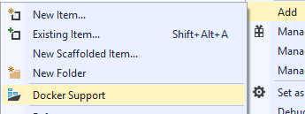

   >**Talking Point**: With Visual Studio, I’ve learned. When in doubt, right click. If it’s important, it must be here somewhere. If we look here, right on the Project, we see **Add Docker Support**

3. Point to **dockerfiles** in the project. Point to **docker-compose** startup project. Point to **Docker target** in the debugger

   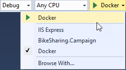

   >**Talking Point**: By adding Docker, Visual Studio will add all components that I need to make my application a containerized application:
   
   >A Dockerfile represents how my image will be built, including all the dependencies I need in my OS. VS scaffolded it for you, but we don’t hide it. It’s yours, and you can continue to edit as your requirements evolve. They become part of your application build definition.
   
   >A Docker-Compose project defines that startup parameters for my single, or ultimately my multi-container application. Through docker-compose, we can start debugging a collection of containers. We’ll touch on this more in a bit.
   >With this integration, you get the experiences you’d expect from Visual Studio, while staying true to the docker commands you’ll find as you learn more about docker.

4. Click on **Docker** to start debugging.

   

   >**Talking Point**: Let’s run our site to see what Marketing provided. Because we have rich Visual Studio integration, you hit F5 and everything just falls in place.

   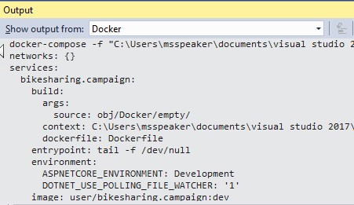
   
   >**Talking Point**: Without having to become a Docker expert, Visual Studio will execute the appropriate docker commands on your behalf, using the standard dockerfiles we’ve just reviewed. It will build our project, build the docker image and start the debugger. And, all the commands are sent to the output window to take away any mystery. I didn’t have edit my code, add package references, learn new muscle memory.

5. Browser Page Opens.

   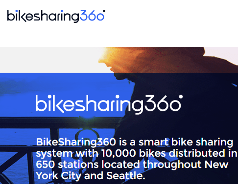

   >**Talking Point**: Once the container is built and instanced, we can see it here in the browser. This is the same app that I was just running on IIS Express, now running in a Docker Container.

6. Open **Views\\Home\\Index.cshtml**

   >**Talking Point**: Because this is Visual Studio, you’d expect to make changes in your code. We can quickly and iteratively make changes to our layout and code.

7. Replace **BikeSharing360 is ... Seattle** with **BikeSharing360 is ...(YOUR CITY)**

   >**Talking Point**: If we make a text change here in Visual Studio, running on my dev machine and save the change, I’d expect to be able to see that same change in my browser.

8. Refresh the page

   

   >**Talking Point**: And, you’d be right. Even though we’re running in a Docker container, Visual Studio has configured Docker Volume Mounts to mount our code, from the container, back to the directory of my project. A big goal of our Docker Tools was to make it feel like Visual Studio, while still maintaining the Docker primitives. This is just one of the cool things our Visual Studio Docker Tools do to maintain and improve your productivity while using new technologies. 

## Task 1: Publishing Single Containers to App Services

**Scenario:** Want to get a quick validation, deployed to Azure. Or, the
app is simply a single container app and App Services provides a great
way to provide scalable single container services.

>**Talking Point**: One of my favorite features of docker is its containment. Now that I’ve successfully built and run this docker image, I can deploy and run this docker image on any docker host, in the world. Any host from on prem to the cloud, it will run the same. Gone are the days when my manager runs into my office describing a bug that no matter how hard I try, I’m unable to reproduce it on my machine. She says, no problem, we’re going to ship your machine, because that’s the only place it works. Now, I like my machine, so I’m not ready to give it up. What if I could host my container in Azure? What if it were as easy as asking Azure to host this specific image? Azure App Services is a great way to host my code. But App Services can now host docker containers as well. With Azure App Services Linux, I can build a docker image, host it in a Container Registry and run it under App Services.

1. Right click project and click on **publish**                                                                                  
   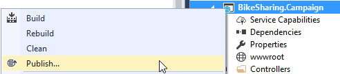

   >**Talking Point**: Now I might wonder how I can do all those steps. But, with Visual Studio, I can right-click and find the answer. Right here on the project, I see Publish.

2. Create a **new profile**

   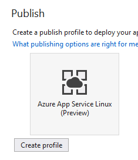

   >**Talking Point**: You might be familiar with publishing as this is the same experience you’re used to. The first thing we’ll do is create a new Publishing Profile.

3. Point to: **Subscription, Resource Group, App Service Plan**   

   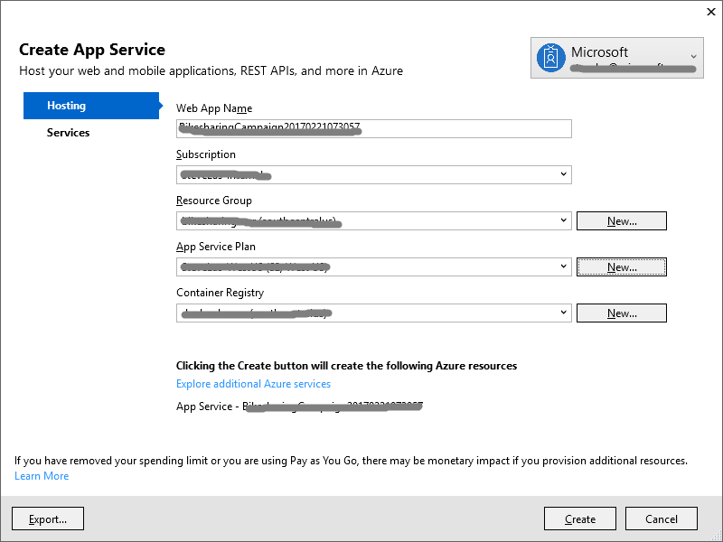                     
                                                                                                 
   >**Talking Point**: Now that we’re publishing containers to App Services, we have a few new options. Options that are available because I’ve chosen to publish a docker image. I can Name the App and choose where the App Service will run.
   I can choose from an existing App Service Plan or create a new one. I can choose from an existing Azure Container Registry, or create a new one. These are the things I need to know for working with containers, however Visual Studio has presented me with all the options. No guessing what I need to set, or what values I need to set them to.

4. Click **Create**                                                                                                                                                    
   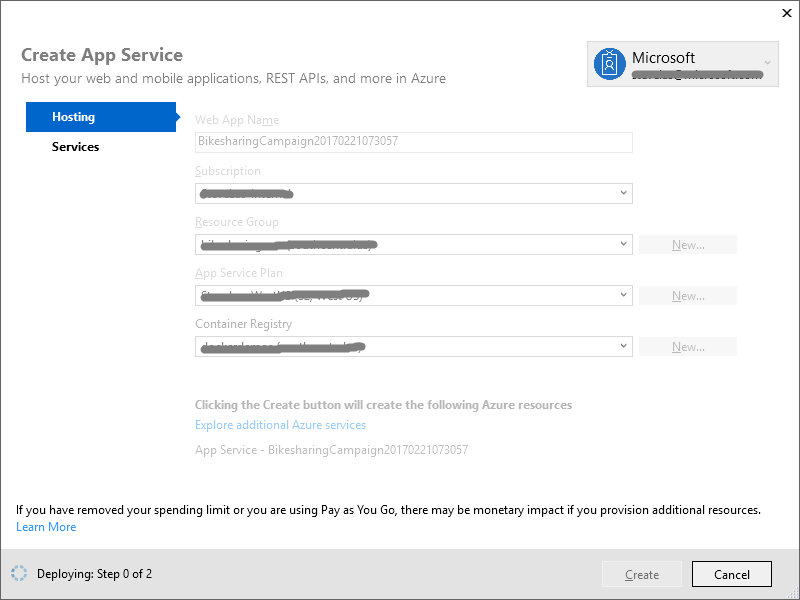
   
   >**Talking Point**: With our options configured, which as many of them defaulted as possible, we can create the Publishing Profile. Visual Studio will make sure the resources we need are provisioned in Azure. Including any new App Services or Container Registries.

5. Click **Publish**

   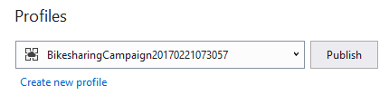

   >**Talking Point**: Now that our profile is created, with the underlying resources provisioned, we can publish our app.
    VS will build our release configuration, publish the output, build an optimized ASP.NET Core image using the Dockerfile from my project. It downloaded the credentials for the Azure Container Registry that it may have just provisioned. It will push our built image to our private Azure Container Registry. We can see our docker push happening right here. Once pushed, VS will configure App Services to pull that docker image and run it. I build my code, tested it in a container locally. I’ve published my app as a container. Visual Studio will do all the packaging for me and make it run in Azure App Services, just as it did here. Again, I didn’t ***need*** to learn lots of new things. I built on the experience I’m already used to.

6. Browser Opens

   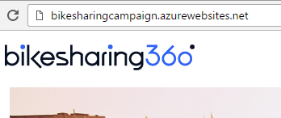
   
   >**Talking Point**: Now that our app is deployed, we can see it running our marketing site. With Visual Studio Container Tools, you’ve now build and published your first docker container. While the experience is Visual Studio, the files are docker. You’re staged to continue learning, at your pace while maintaining your productivity.                                                                                                                                                        
   
## Demo 2 Setup

- Click on ***Overview***

- **CTRL+ALT+B** -**load breakpoints** Set breakpoints by hitting the import breakpoints button

  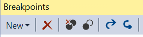

- **Collapse all projects**

  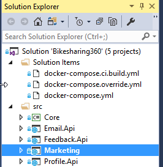

- Right-click on the **docker-compose** project and select **"Set as StartUp Project"**

- Start Docker Solution Debugging to warm up the instances

  

- Stop debugging, close the last session browser page

## Demo 2: Developing, Debugging and Deploying Multi container microservices

### Task 1: Multi-Container App – Debugging 

1. Open **MultiContainer** Solution

   >**Talking Point**: Now that we have the Marketing site running, and our manager is all excited to see containers running, she wants to add a collection of new services. A Profile service to remember user interests, Email so we can notify customers of new locations and Feedback so our support teams know if the customers have something to tell them. Because we’re using containers, we can implement this in a microservices architecture. We can have various team members work on different services. They may even choose different languages and frameworks as we no longer need to have everything working on the same infrastructure. Each container has its own environment.
   
2. Point to various projects.

   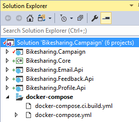

   >**Talking Point**: As we open the solution in VS, we can see we have multiple projects loaded. All but the Core project represents individual services. The Core project represents some common code we may share across different services. Each service is run in its own container. But, when we develop multi-container solutions; we have multi-container challenges. For example, how do I even define all the components that make up my application? How do we tell VS to run multiple services, at the same time? Using Docker-Compose, we can leverage Dockers way for instancing multiple services, with built in service discovery. We run this all locally using Docker for Windows.

3. Point to Solution Compose files.

   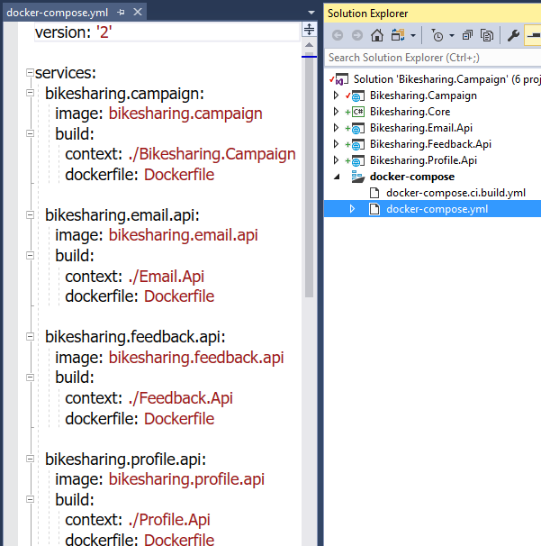

   >**Talking Point**: Notice we have a compose file in our compose project. This file references multiple services. The services may be backed by code in our project we can edit and debug. Or, they may reference images built by other team members using Java, Python, Node, Go or Haskel. That’s the beauty of running microservices in containers. We don’t need to know how the image was built. From a Visual Studio concept, we can think of these as source and binary references. If the service has a build definition, that points to a project, it’s a source reference as we can edit and build it each time. If the service is identified only by its image name, this would be like referencing a compiled dll. Except you’re no longer limited to what can be packaged as a dll.

4. Click on F5

   

   >**Talking Point**: Now that we’ve seen our microservice definition, we can start our debugging. Visual Studio will build all the images that are locally defined. If we had any services that were referenced only as an image, VS would pull that image and instance it, based on any parameters defined in our service definition. As we start our solution debugging, we can see a Docker output window capturing the build process. Each project is built, each image is built, and the collection of images and services are started. Now that we have multiple containers and services running, we may need to debug across those services. Because we have the source and we’re debugging, Visual Studio will attach the debugger to each project.

5. Browse Opens Scroll Down

   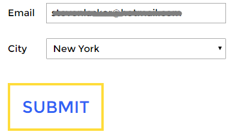

   >**Talking Point**: Once the images are built and instanced, we can see our new marketing site come alive. If we scroll down we can see the new functionality. 

6. Enter email

   >**Talking Point**: If we enter our email, we can start to see our services kick in.

7. Visual Studio Opens

   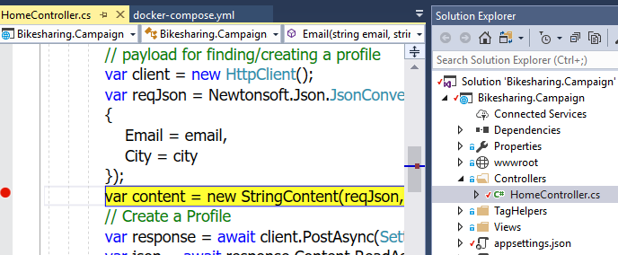

   >**Talking Point**: Once we submit the page, we can see our controller kick in. If we look to our Solution view, with active item tracking, we can see the breakpoint is in the **HomeController** within the Campaign site. We can use all the standard debugging tools to inspect and even set the value of variables.

8. Hit Continue

   

   >**Talking Point**: This is where the fun begins. When we hit continue, the controller returns back to the browser as we’re in an async call. A request is made of our Profile API service to create a profile for the user. I can debug across that service boundary, just like I would debug any dll within visual studio.

9. Hit Continue

   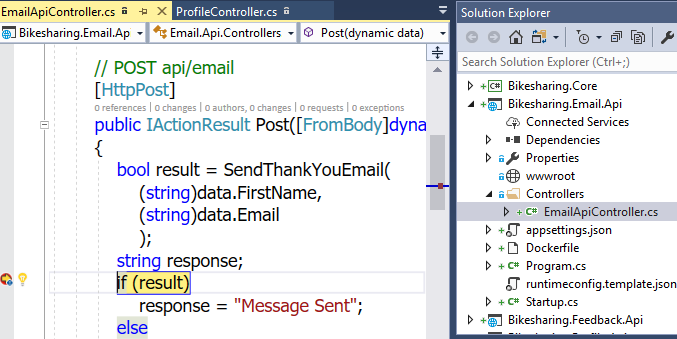
   
   >**Talking Point**: If we hit continue again, we can now see we’re in the Email API service. As with any multi-service application, things get complex quickly. Services are calling other services and bugs can creep in through a multitude of places. By debugging across multiple services in a single debugging session we can focus on the code flow without worrying about the implementation of microservices.


### Task 2: Configure CI/CD

>**Talking Point**: Now that we know the project is in good shape, we’re ready to deploy it. Now, this one is more complicated than our initial Marketing campaign site. We have a collection of services to manage. A specific change may require changes across a few services. Do we really want to deploy several individual services? Now that we’re running a multi-container microservice application, we’re likely ready for a true continuous delivery workflow. With each check-in, we want a build and deploy pipeline to complete the docker builds, for each service and orchestrate the deployment of the collection of services. Now, that would normally be a complex process. You might think, ughhh, let me get a big cup of coffee and read Donovans blog for how to set this up.

1. Right click on either project choose **Configure Continuous Delivery**                                                                                          
   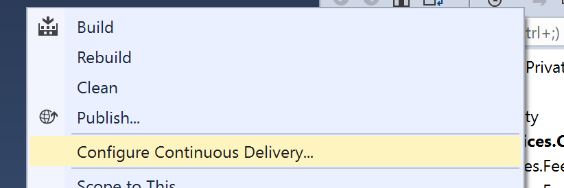

   >**Talking Point**: But once again, I’ve learned to trust VS. We’ll right click on the project, and right there, we have Donovan in a box.

2. Click **Ok**                                                                                                               

   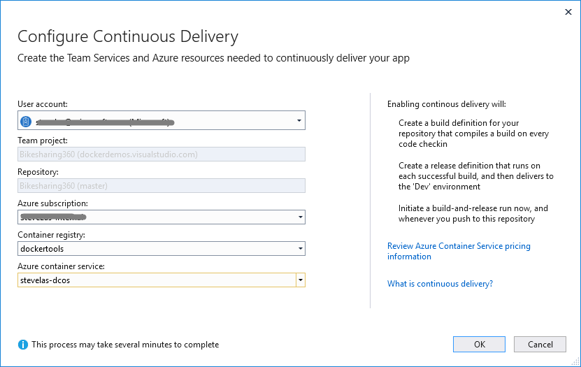

   >**Talking Point**: VS will setup a build and release definition for this repo on VSTS. It compiles your .NET Code, builds the docker image, publishes your container images to an Azure Container Registry then deploys it to ACS. So after every Git Push from here on, VSTS will re build and deploy the collection of changes services. It will be your choice to configure auto deployment from Staging to Prod. And over time, we’ll help you with blue/green deployments as well. The magic here is, once again, Visual Studio will do the smart thing for you. You can certainly drill in and make changes. But you no longer have to configure this all from scratch, each and every time.
 
   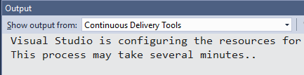
  
   >**Talking Point**: Once you click Ok VS will go off and start creating those resource on VSTS.                              

3. Open the Build Definition 
  
   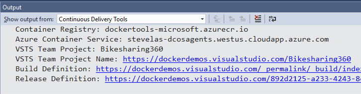
  
   >**Talking Point**: Once our configuration is complete, we can view the build in VSTS. The VSTS Build Agent is running as a docker container in our ACS Instance. I no longer have to wait for a hosted build agent, or pay for a build agent continually running as a VM. We’ve taken full advantage of containers, orchestrators and the power of VS and VSTS. 

### Task 3: Configure VSTS

1. Click the **build link**

   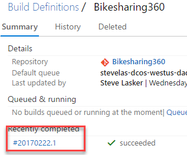
   
   >**Talking Point**: Here we can see our build in flight. By clicking on the build, we can see it’s status. We can see it executing, or it may already be complete.
   
2. Edit Definition 

   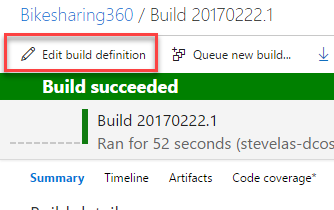
   
   >**Talking Point**: We can review and edit the definition that was configured for us by Visual Studio. This takes all the context we have around building .NET Services, combines them with Docker, the Azure Container Registry and Azure Container Service to build out a production pipeline.

3. Click **Build Repository**
  
   

   >**Talking Point**: The first step uses a **docker-compose.ci.build.yml** file that was scaffolded into our project to restore, build and publish our .NET Projects. The build itself is done in a container, so all the bold dependencies we require can be defined by the project owners. No longer do we need specific VSTS build agents configured with the gulp, bower, npm. All those dependencies are defined in the aspnetcore-build image. 

4. Click **Run unit tests**

   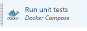

   >**Talking Point**:Our next step scaffolded out a convention for running unit tests

5. Click **Build service images**                                                                                                                                                                
   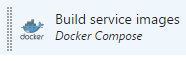
   
   >**Talking Point**: The next step will use the docker-compose file to determine which images should be build. This takes the published and tested output from the previous steps and builds optimized runtime images using the aspnetcore image. The subsequent steps will push the test results to the VSTS Dashboard. Push the images to the Azure Container Registry, preparing for deployment. Write Service Digests will capture the hash of the images that were just pushed. This is the way to assure only the image we’ve just built will be deployed. As new containers are instances, based on the current deployment, we want to assure the hash of this build is deployed. Not another image that happens to have the same tag name.

   This is where Visual Studio has set you up for success. You’ve taken your Visual Studio and .NET Knowledge and built upon it. You’re doing
   microservice development using Docker with a full CI/CD pipeline. You can choose to dig into the files, commands and learn more about docker over time. But you didn’t have to become a docker expert just to get started. Even more important, as your project expands, so can your configurations. With the power of Visual Studio and Visual Studio Team Services, you know the configuration can scale to your needs.
