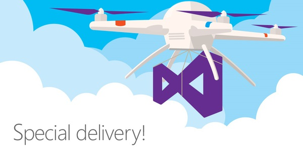

# VS2017-Canarys-Demo-Scripts

## VS2017 KeyNote Demo Scripts

 

<table><thead>
<tr>
<th>Labs</th>
<th>Demo Script</th>
<th>Demo Video</th>
<th>Source Code</th>

</tr>
</thead><tbody>
<tr>
<td>Visual Studio 2017 Install and Performance</td>
<td><a href="/Installation and better Performance">Demo Script</a></td>
<td><a href="https://channel9.msdn.com/Events/Visual-Studio/Visual-Studio-2017-Launch/100#time=0h15m37s">Demo Video</a></td>
<td><a href="https://github.com/Microsoft/BikeSharing360_Websites">Source Code</a></td>
</tr>
<tr>
<td>Shift Left - Tradional look at DevOps</td>
<td><a href="">Demo Script</a></td>
<td><a href="https://channel9.msdn.com/Events/Visual-Studio/Visual-Studio-2017-Launch/100#time=0h20m32s">Demo Video</a></td>
<td><a href="https://github.com/Microsoft/BikeSharing360_Websites">Source Code</a></td>

</tr>
<tr>
<td>.NET Core tools in Visual Studio 2017</td>
<td><a href="/.NET Core tools in Visual Studio 2017">Demo Script</a></td>
<td><a href="https://channel9.msdn.com/Events/Visual-Studio/Visual-Studio-2017-Launch/100#time=0h34m34s">Demo Video</a></td>
<td><a href="https://github.com/Microsoft/BikeSharing360_Websites">Source Code</a></td>

</tr>
<tr>
<td>Microservices and Docker</td>
<td><a href="/Microservices and Docker">Demo Script</a></td>
<td><a href="https://channel9.msdn.com/Events/Visual-Studio/Visual-Studio-2017-Launch/100#time=0h42m22s">Demo Video</a></td>
<td><a href="https://github.com/SteveLasker/Bikesharing360-Single/" >BikeSharing360-Single</a>
     <a href="https://github.com/SteveLasker/Bikesharing360-Multi/" >BikeSharing360-Multi</a></td>

</tr>
<tr>
<td>Visual Studio and Xamarin</td>
<td><a href="/Xamarin Cycle">Demo Script</a></td>
<td><a href="https://channel9.msdn.com/Events/Visual-Studio/Visual-Studio-2017-Launch/100#time=1h08m15s">Demo Video</a></td>
<td><a href="https://github.com/Microsoft/BikeSharing360_Websites">Source Code</a></td>

</tr>
<tr>
<td>Visual Studio Mobile Center</td>
<td><a href="/Visual Studio Mobile Center">Demo Script</a></td>
<td><a href="https://channel9.msdn.com/Events/Visual-Studio/Visual-Studio-2017-Launch/100#time=1h19m05s">Demo Video</a></td>
<td><a href="https://github.com/Microsoft/BikeSharing360_Websites">Source Code</a></td>

</tr>
<tr>
<td>VSTS and DevOps</td>
<td><a href="/VSTS and DevOps">Demo Script</a></td>
<td><a href="https://channel9.msdn.com/Events/Visual-Studio/Visual-Studio-2017-Launch/100#time=1h37m43s">Demo Video</a></td>
<td><a href="https://github.com/Microsoft/BikeSharing360_Websites">Source Code</a></td>

</tr>
<tr>
<td>RedGate and Visual Studio 2017</td>
<td><a href="/Redgate and Visual Studio 2017">Demo Script</a></td>
<td><a href="https://channel9.msdn.com/Events/Visual-Studio/Visual-Studio-2017-Launch/100#time=1h54m38s">Demo Video</a></td>
<td><a href="https://github.com/Microsoft/BikeSharing360_Websites">Source Code</a></td>

</tr>
<tr>
</tbody></table>

This project has adopted the [Microsoft Open Source Code of Conduct](https://opensource.microsoft.com/codeofconduct/). For more information see the [Code of Conduct FAQ](https://opensource.microsoft.com/codeofconduct/faq/) or contact [opencode@microsoft.com](mailto:opencode@microsoft.com) with any additional questions or comments.
