# Visual Studio 2017 Productivity Features

<p align="center">
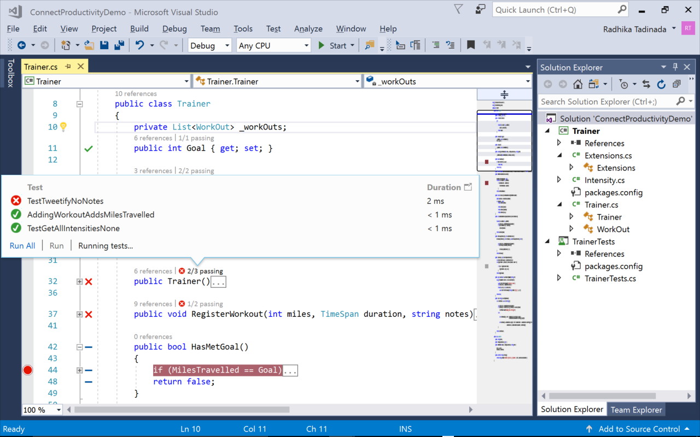
</p>

## Overview

The new productivity improvements that we have added in Visual Studio 2017 allow you to make major code change quickly and with confidence while keeping you in the zone of your development.

## Demo 1: Live Unit Testing

1. Open the **Visual Studio 2017** and load the **BikeSharing.Web** solution.

   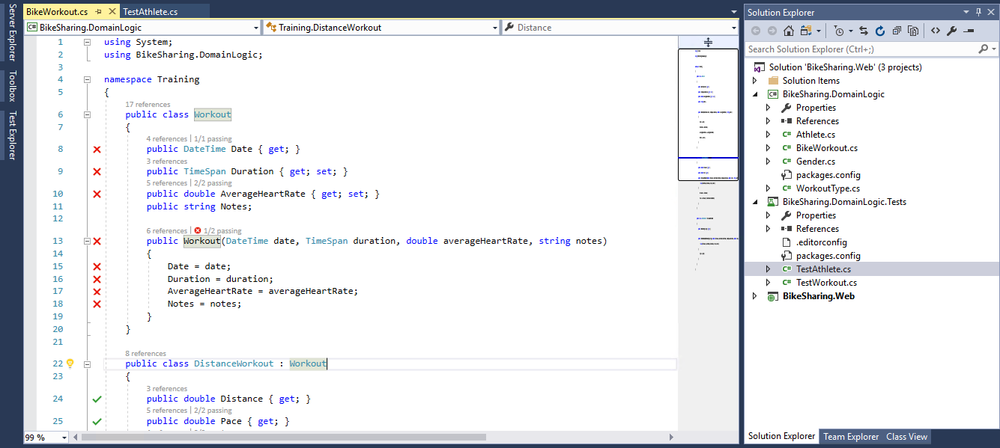

   >**Talking Point**: Here, I have a simple program that helps me to tweak different bike workouts.

2. Open the file **Athlete.cs** from **BikeSharing.DomainLogic** project.

   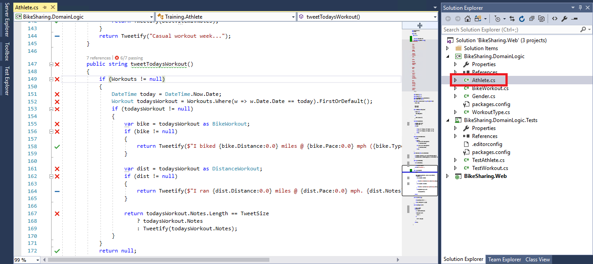

   >**Talking Point**: However, the first thing that you are noticing are all these icons on the left hand side. These are part of live unit testing. Live Unit Testing is constantly running unit tests in the background and updating these icons so that you can know the status of your code. A Red "X" indicates that this line is hit by atleast one failing test while a Green "check" indicates that this line is hit by all passing tests and a Blue "dash" means that this line is not covered by any test at all.

   
3. Click on the **X** icon and see exactly which tests are hitting here.

   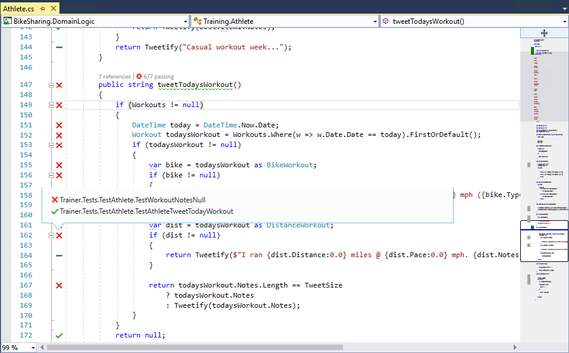

   
4. Click on the Test here to navigate directly to it.

   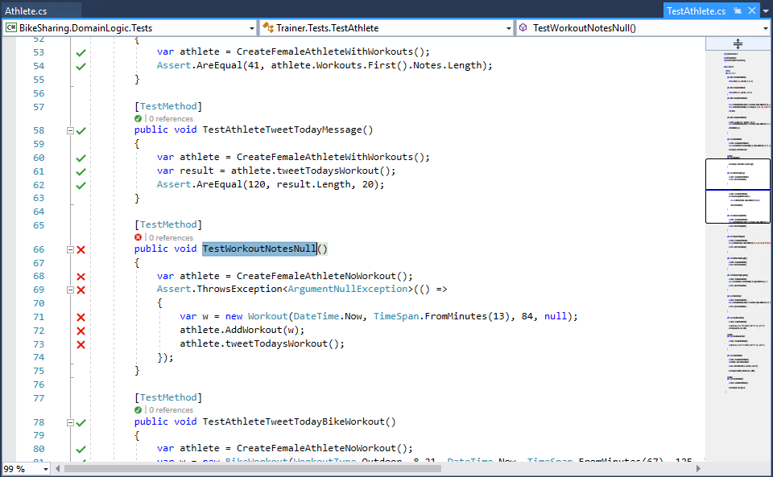

   >**Talking Point**: I am not totally sure why this test is failing. So, i am gonna go and start debugging.

5. Start to Debug the failed test from your **Test Explorer** and you should see it throws a null reference exception as shown below. 

   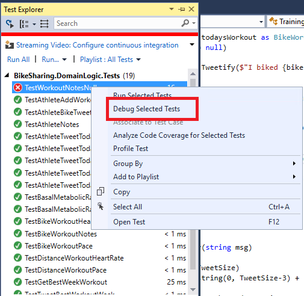

   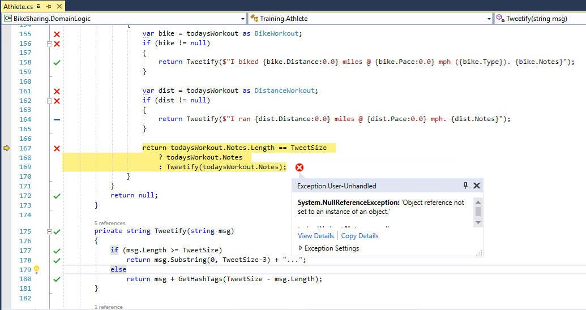

   >**Talking Point**: This is part of a new exception helper in Visual Studio 2017 while we try to put the most useful information at the top like which variable is null and so on.

6. You can see here it even works, we have a chain of dotted expressions.

   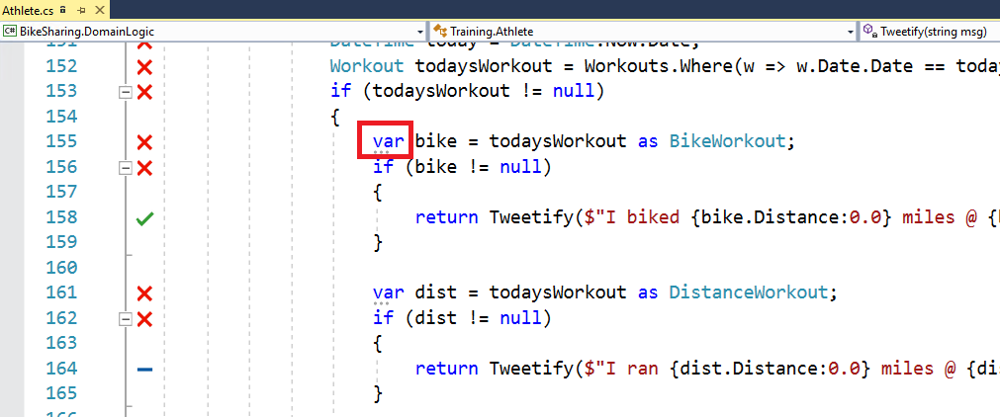

   >**Talking Point**: So according to **todaysWorkout.Notes** was null, it specifically says that notes is returning null. So, now that i know notes can be null, I want to see anywhere else in my code when accessing a member of notes where i can potentially have another null reference exception.

## Demo 2: Finding all references

1. To do this, I am gonna do **find all references**. Select **Notes** and press **SHIFT+F12** or right click and **find all references**.

   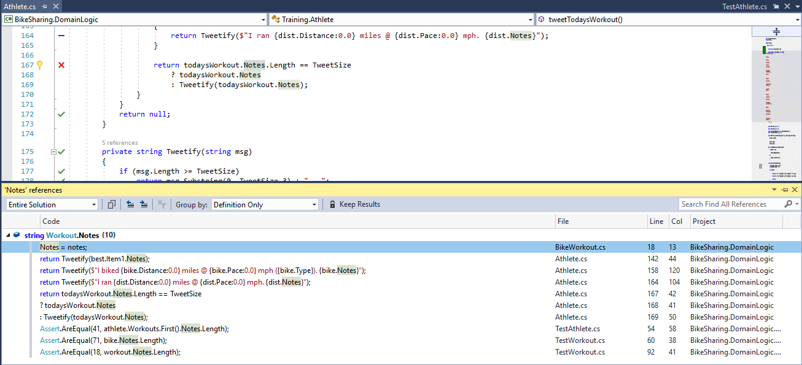

   >**Talkiing Point**: This looks simple. No longer is **Find All References** a simple flat list, now its colorized. We even allow you to custom group how things are sorted in your results. If i take a look at this result, I can see the only member I am ever accessing of a **Notes.length** that I already have tests covering that currently is failing. Lets go fix it. I can quickly navigate to where I am initializing this.

2. Let's add quick null check. Add the below code snippet in the line number 18 of **BikeWorkout.cs** file.

   ```
   if (notes ==null)
    {
        throw new ArgumentNullException(nameof(notes));
    }

   ```
  
   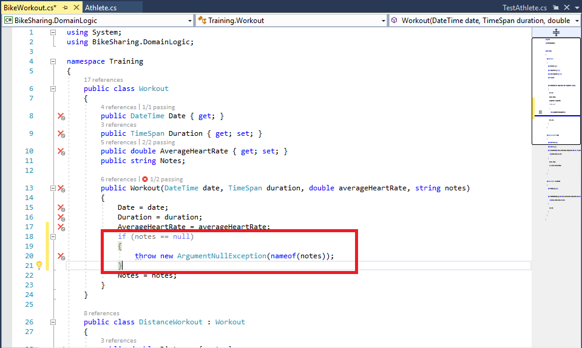

   >**Talking Point**: I never should be able to initialize these notes as null. The whole point of this app is to make fun tweaks of my bike workouts to impress my friends so i am just going to add quick null check.

3. As you type the code, you can notice that the Intellisense looks a little different. 

   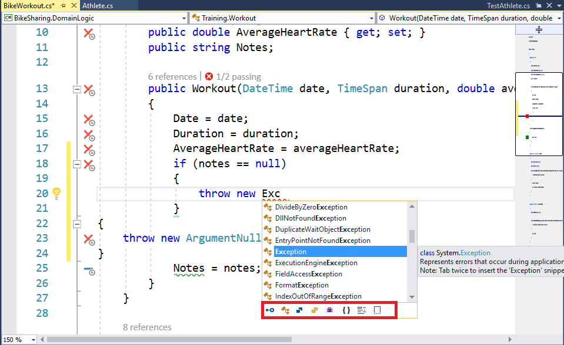

   >**Talking Point**: In Visual Studio 2017, we have added a tray of icons at the bottom to allow you to filter your completion list by **category**. This is especially helpful if you are working with complex API in a large code base where your completion list has many items in it. Or, if you are a WPF developer, its really helpful to sort this by events only. I am gonna finish the typing by using Camel case matching.

4. If you see on the left hand side, the Live Unit Testing is being run after the code changes.

   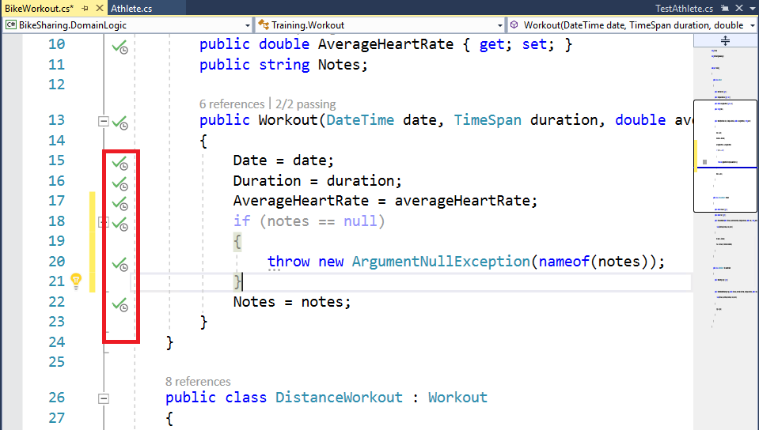

   >**Talking Point**: If you are looking on the left hand side, you could see the Live Unit Testing is picking up which test is impacted by the code change, running them and updating these icons to let me know all my tests are now passing.

5. Navigate back to the initial method that was working. Click **CTRL+T** which brings up **GoToAll** that allows you to quickly navigate to any file, tag etc.

   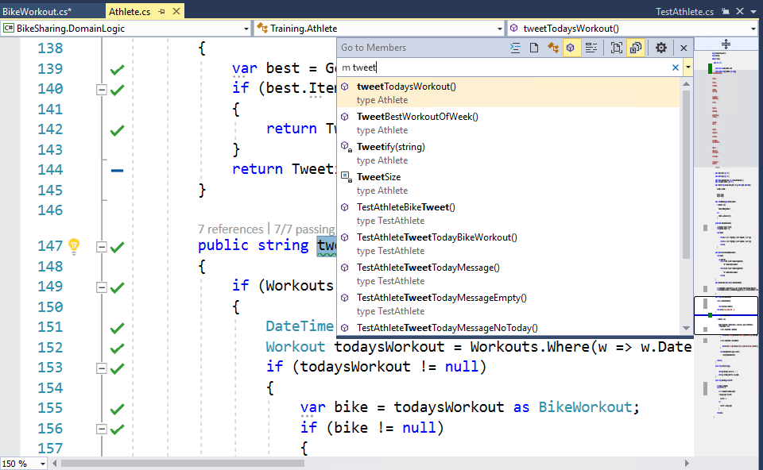

   >**Talking Point**: I could hunt for this in the Solution Explorer or try to remember in my open tab or which file is in to find it. Or, i could just use "Go to All" which I can get here using Ctrl+T. Go to All allows you to quickly navigate to any file tag or member or symbol decoration from a single location. I can use a query syntax to filter only members and I can start to type the name of the method and navigate directly there. I can see that all my tests are passing. So before i submit this code for review, I actually want to clean it up little bit.

## Demo 3: Code Suggestions

In Visual Studio 2017, we have added the concept of code suggestion. Code suggestions allow you to have best practices or alternate coding patterns to developers.

1. Go to line number **155** and select **var** then press **CTRL+.**

   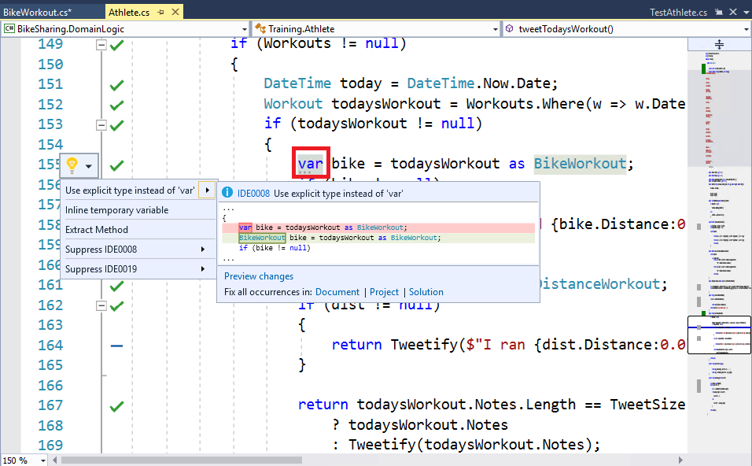

   >**Talking Point**: So, if i wanted to access the one that is here, I can just press CTRL+. thats gonna tell me that I should use the exquisite type instead of "var". This is because my team truly believes that we should always use the explicit type instead of "var" to understand and for readability. If I want to actually apply this, I can just press Enter and now all my code here is in style.

2. Press **CTRL+T** and search for **editorconfig**.

   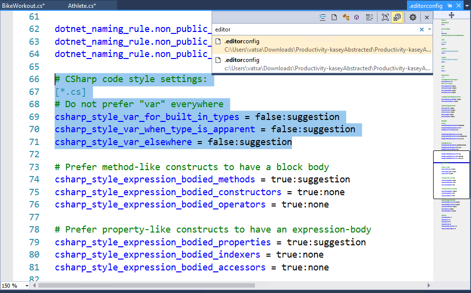

   >**Talking Point**: Infact, Visual Studio 2017 supports coding conventions by allowing your team to configure your own team preferences and enforce however they want inside the editor with the editor config file. 
   Editor config is an open-source file format and we have worked with their community to have it work with .NET code style as well. If i scroll down here, you can see here are "var" preferences for my team. You can see that we choose to not prefer "var" and that if you do violate this rule by using the "var", it will trigger suggestion inside the editor to fix it. 
   Alternatively, I could have made it a warning or an error if I want existing code style everywhere. I will just keep this as a suggestion for now. Also, building on top of this, you can define your own naming conventions in editor config.
   So, if I investigate what is going on here, you can see that i have violated my team's naming convention and this one is being used Pascal's case for methods so that with a single click I can now make my code adhere to my team's code style.


## Demo 4: C# 7 New Language features( Tuples)

Not only all my code suggestions are great helping drive consistency across the repository, but also they are great for teaching new language features. Perhaps,most exciting language feature coming in C#7 is <a href="https://blogs.msdn.microsoft.com/dotnet/2016/08/24/whats-new-in-csharp-7-0/">**Tuple**</a>. Tuples allow you to return multiple values for methods so you dont have to juggle out parameters.

1. Go to **Athlete.cs** file. You can see here that i am returning both workout and double. I am consuming it down here and then accessing Tuple elements with their default names of **Item1** and **Item2**. If you look close, you can see I am getting a code suggestion here, so lets investigate it.

   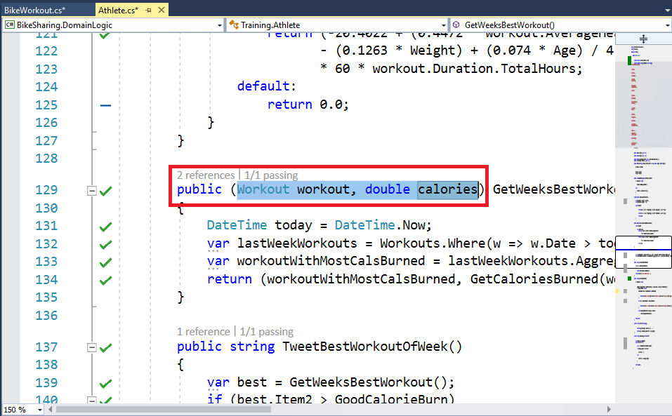

   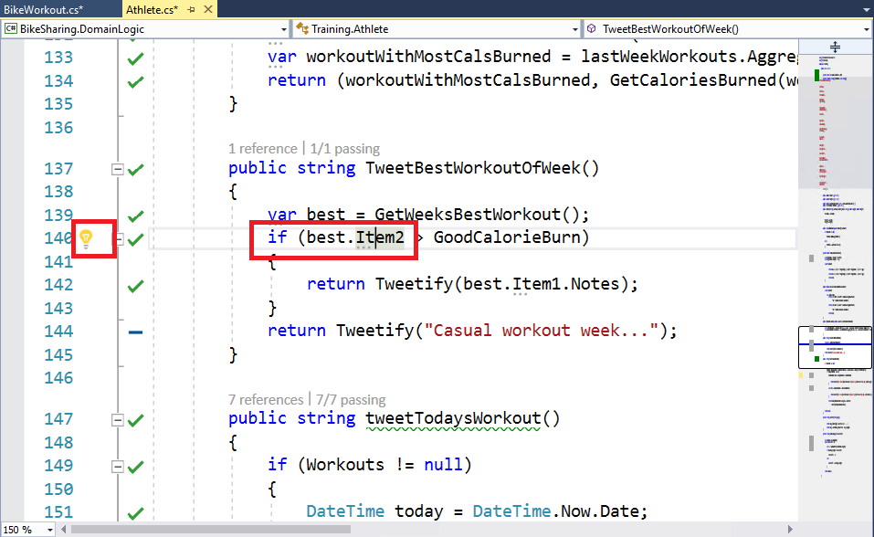

   >**Talking Point**: You can see that how we need to use the explicit tuple name rather than its default name of Item1 and Item2.
   So, i can quickly apply this text and improve the readability of my code. If you remember when i was adding a no-check earlier, you may have noticed that a code suggestion is available there.

2. Quickly navigate to the suggestion and apply. You should now see the explicitly provided tuple name here.

   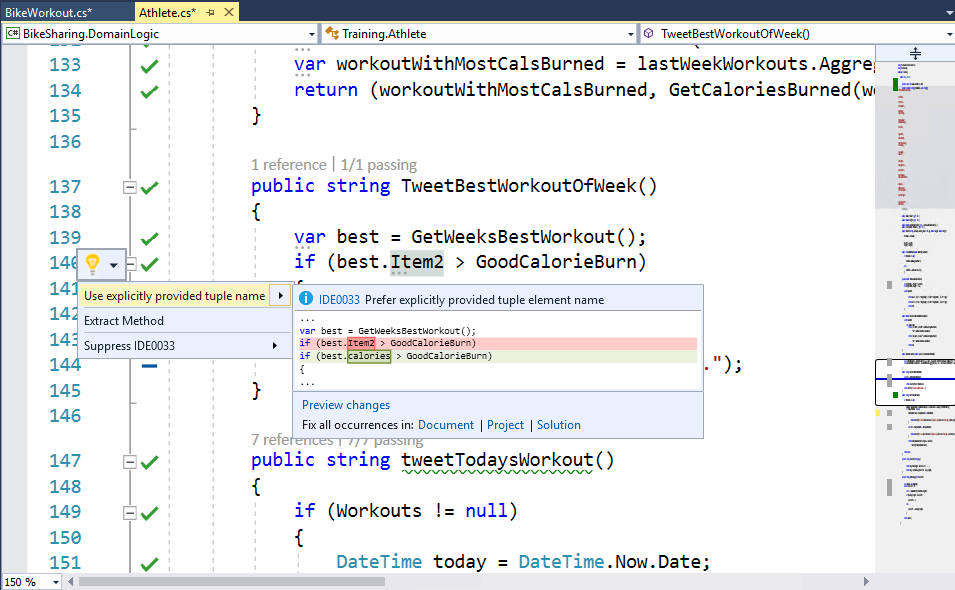

   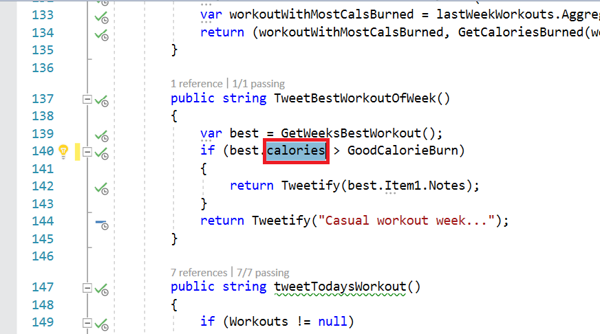

3. If you remember when i was adding a no-check earlier, you may have noticed that a code suggestion is available there. Go to **BikeWorkOut.cs** file and to the line number **20**, you can see the code suggestion here.

   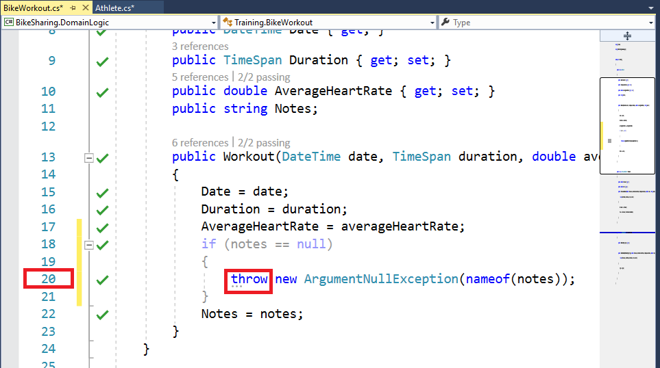

4. I can see that its telling me to use the **C# 7 throw expression** to help condense my code.

   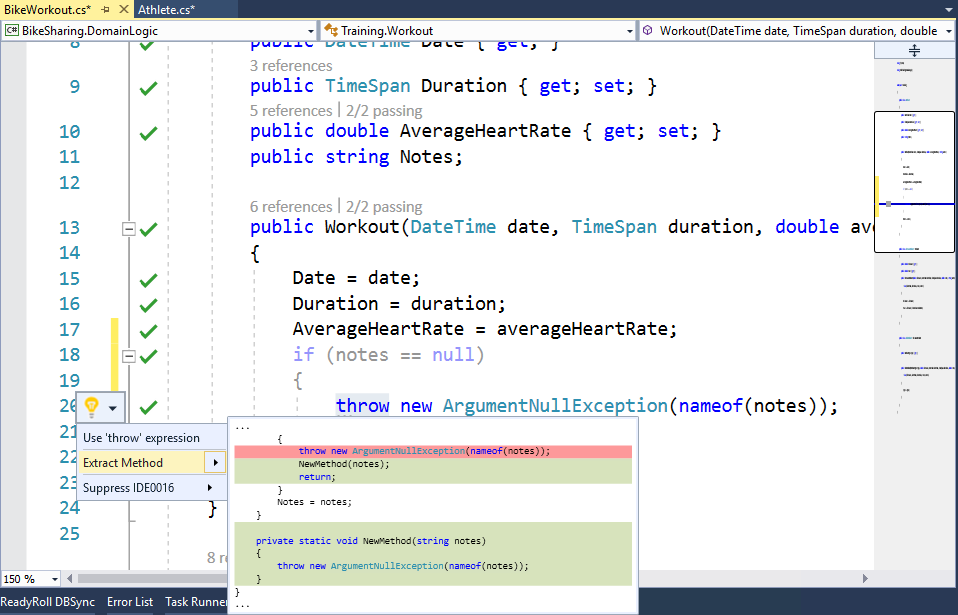

5. Once the change is done, you should see as shown below.

   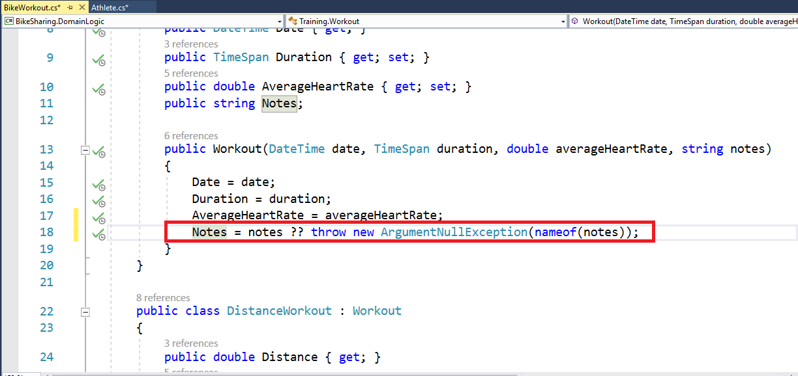

   >**Talking Point**: Now that my codebase adheres to my team's code style and i have helped move my code forward by embracing C# 7 language features, I'm almost ready to submit this code for review. The last thing I got to do is refactoring.

## Demo 4: Code Refactoring

Visual Studio 2017 has added a ton of new factoring that help make you more productive. Especially, if you are a developer like me where when i prototype i put all of my types in one file and then later i need to go back and pull them out into their own files. So rather than having cut and paste and add new items to file i can just do this with a single click in Visual Studio 2017.

1. You can see here I have a BikeWorkout in my **BikeWorkout.cs** file where i also have DistanceWorkout and i have one other type that i can't quite see. So rather than scroll, I can use now built-in indent lines to see exactly what other type is there. 

   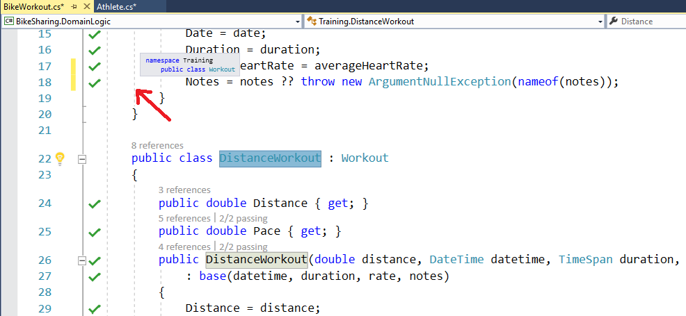

2. To access the refactoring i can just use the same **CTRL+.** that i was using before and if you look here you can see that it is asking me to move my file to a matching name.

   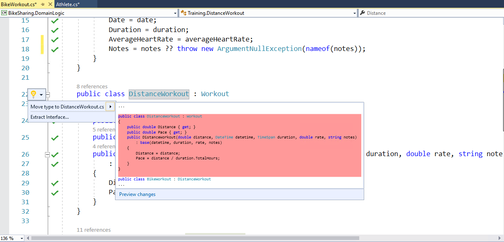

3. And there you go in a single click, it's gone.

   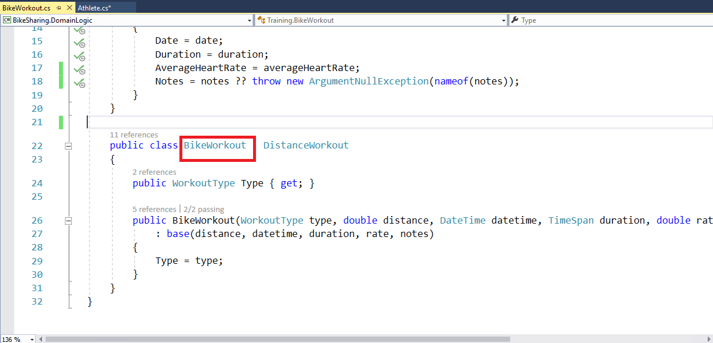

   >**Talking Point**: I can scroll up and do the same with my other type and I have cleaned up my files. I only have a single type that matches the file names that I have and here is where the true power of Live Unit Testing comes in. I have made a major code change, added new files, moved code around and live unit testing figured it out which test to run. So i didn't want to hunt them down in test explorer. It ran them for me without me having to press the button and it updated the icons in the editor so that I dont lose the context of my development.

These are just some of the new features that we have added in Visual Studio 2017 and we can't wait to hear what you think!


   


   


  


   

  


