# Visual Studio Mobile Center

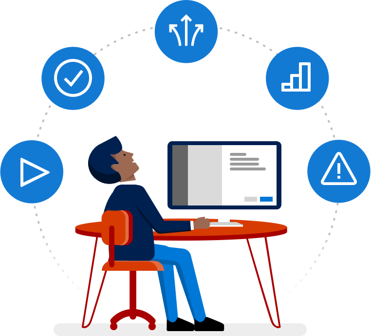

## Overview

Visual Studio Mobile Center is mission control for your mobile apps.

Bring your apps written in any language to Visual Studio Mobile Center’s cloud and lifecycle services and you’ll get faster release cycles, higher-quality apps, and the time and data to focus on what users want.

## Video:

<a href="https://microsoft.sharepoint.com/teams/CADD/DTMS/_layouts/15/guestaccess.aspx?guestaccesstoken=YexJr0X%2b%2b3y%2b7LNvhRO2pXBuP01a42iSEhN29c3D5LI%3d&docid=2_12f9f0fb8605342a1b9387413364ace00&rev=1/" >Reference Video to be added</a>

## Demo

>**Talking Point**: When the team brought the BikeRider app to Seattle, they used the new Mobile Center to bring these new features to life.                     
I want to show you how easy it was to set a Mobile DevOps cycle up and how by using Mobile Center – the team was able to focus on what matters most – building a beautiful app.

1. Click on **Connect with GitHub**.

   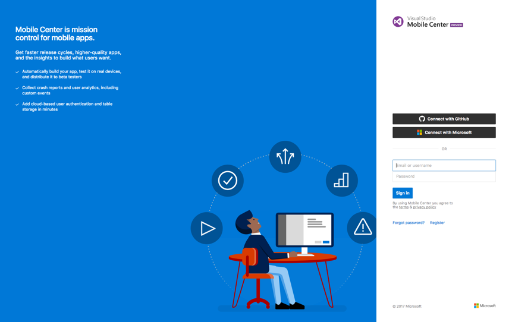

   >**Talking Point**: I am now logging in with my GitHub account. No need to register for a new service, or to remember a new login and password.

2. You should see the Dashboard as shown below.

   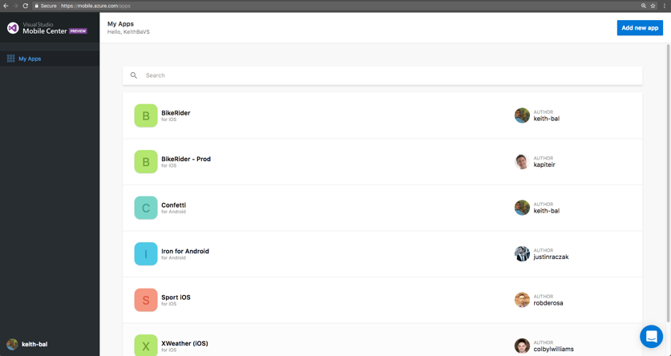

   >**Talking Point**: Once I login, I can see all the apps that my team has been working on.

3. Click on **BikeRider app**.

   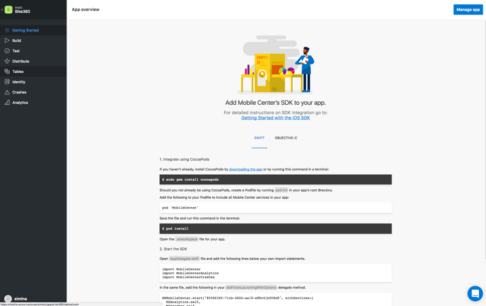

   >**Talking Point**: Let's have a look at the BikeRider app in Mobile Center.

4. Scroll on the **Overview** page.

   

   >**Talking Point**: In the overview page I am being presented with a few easy steps about how to integrate the open source Mobile Center SDK. With only a few lines of code, the app collects crash reports and usage data. As we were working on this app, every time somebody pushes a change in the BikeRider repository, we automatically build it, distribute it to ourselves for testing, and run a suite of UI tests to make sure the most important flows are working.

5. Click on **distribution**.

   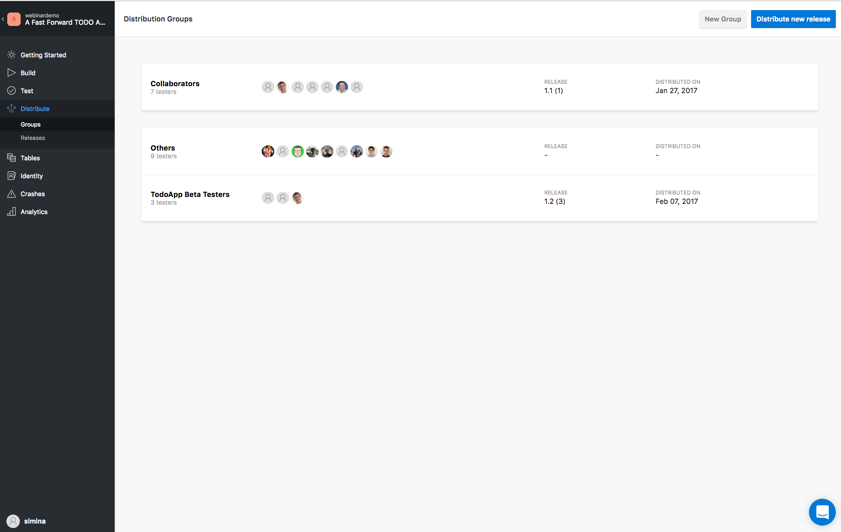

   >**Talking Point**: To manage the testers, I have grouped them into distribution groups.
                                                                                                                                                                
6. Click on **alpha team**.

   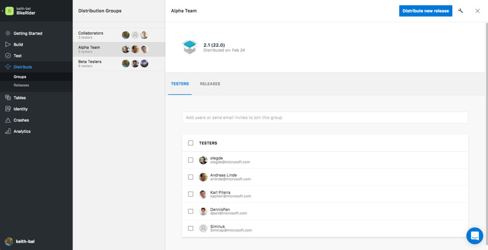

   >**Talking Point**: The alpha team are the devs that should test each new version. I can manually distribute releases to them by uploading the binary, but I want to show you the real power of our services: automatically distributing builds upon each checkin.

7. Click on **Build**.

   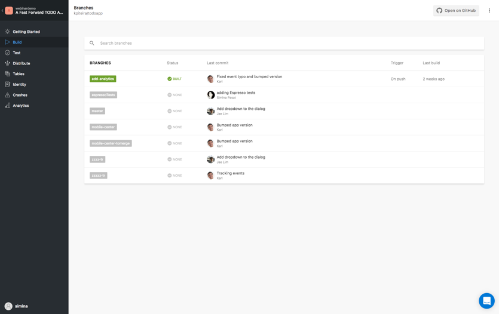

   >**Talking Point**: Since I’m connected with GitHub, Mobile Center already knows about my repositories, branches and project configurations.                                    
   
8. Click on **Seattle branch**.

   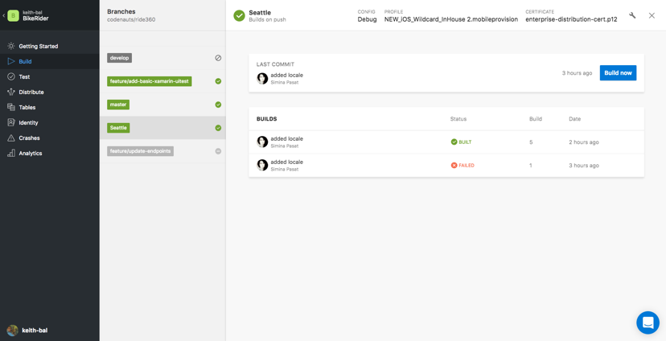

   >**Talking Point**: For the Seattle feature branch, we built the app and distributed each build to the alpha team.
   
9. Click on **Settings (top right) - and scroll as you talk**.

   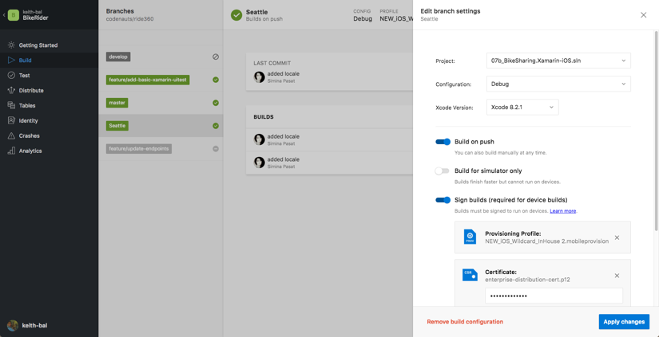
   
   >**Talking Point**: When setting this up, all I had to do was to select the right configurations from the dropdown, upload the signing files and select the alpha team for distribution.
   
10. Close **configuration**.

11. Click on a **build (succeeded)**.

    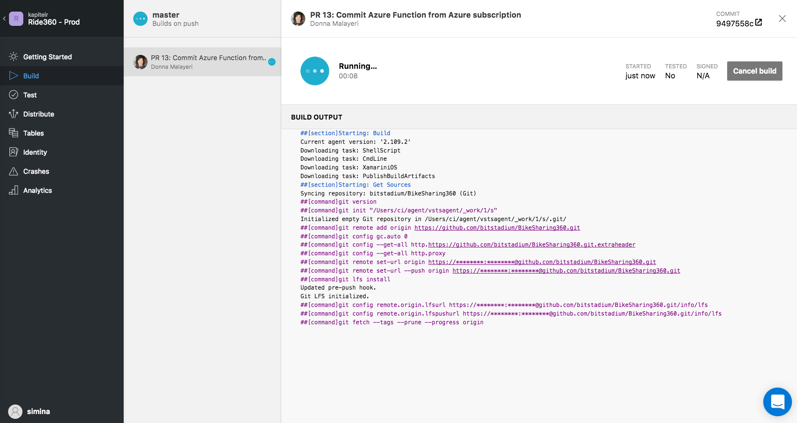

    >**Talking Point**: It only took a few clicks to set up Continuous Integration for this app. Mobile Center runs all builds in our Mac cloud, and you – mobile app developers – no longer have to worry about providing your own Mac hardware for automated builds. No matter how eager testers are to validate they app, they cannot cover all the device combinations and Operating Systems existent out in the wild. 
   
12. Click on **test tab**.

    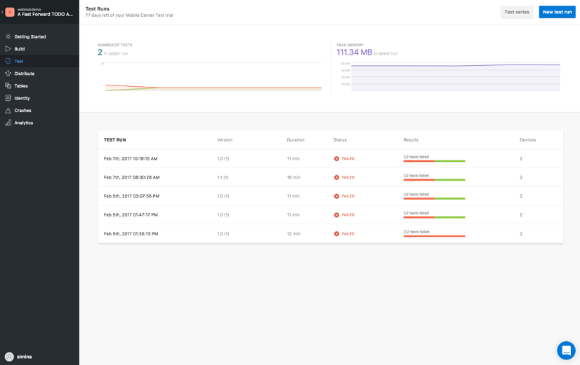
    
    >**Talking Point**: Here in the test section – are all the UI tests that have been executed for this app.

13. Click** on **last test run**.

    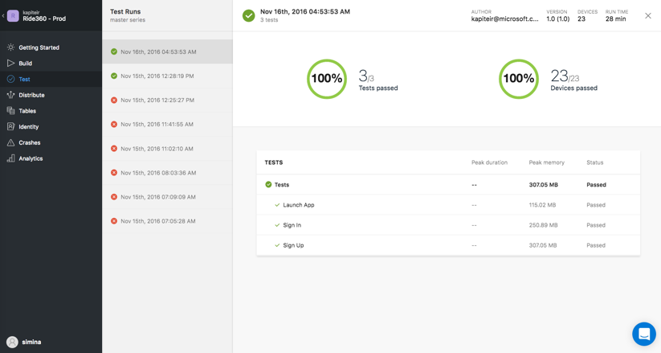
    
    >**Talking Point**: The last tests ran on 28 devices – and consists of three simple tests to validate basic flows.
    
14. Click on a **test**.

    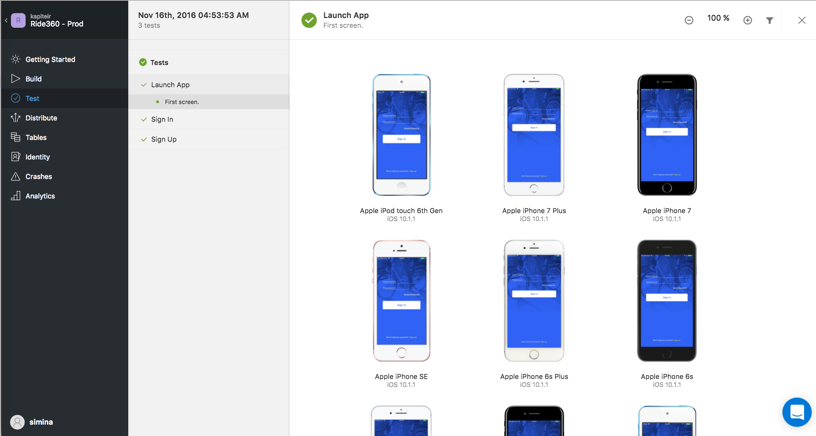
    
    >**Talking Point**: The tests were run on real iPhones.
    
15. Click on a **phone**. 

    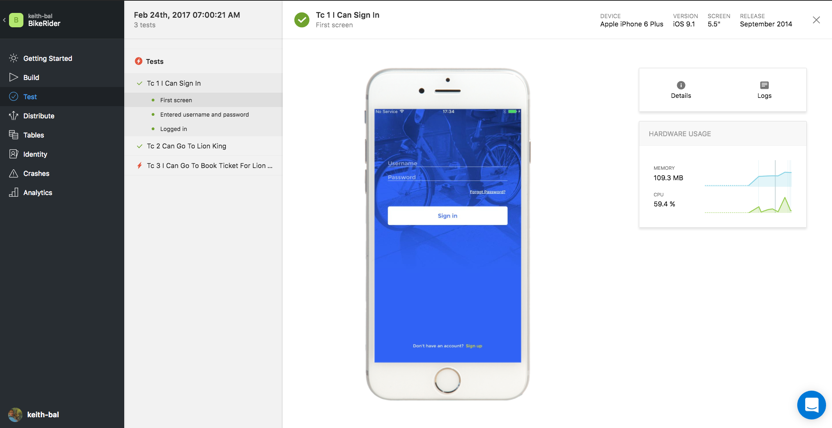
     
    >**Talking Point**: You can see exactly how the app looks like on the devices, whether tests are passing, and even get detailed logs and performance data. We believe that testing and automated UI testing is so important for delivering that 5\* experience. We host thousands of devices in our data center – all you have to do is to write your tests and upload them to us. We take care of the rest.                                                                                     
    
    
    **So far, I showed you how we used Mobile Center to enable fast iterations cycle. Once we distribute the app to more customers, we want to learn from the app's usage and fix issues as they arise.**

16. Click On **BikeRider - Production**.
 
    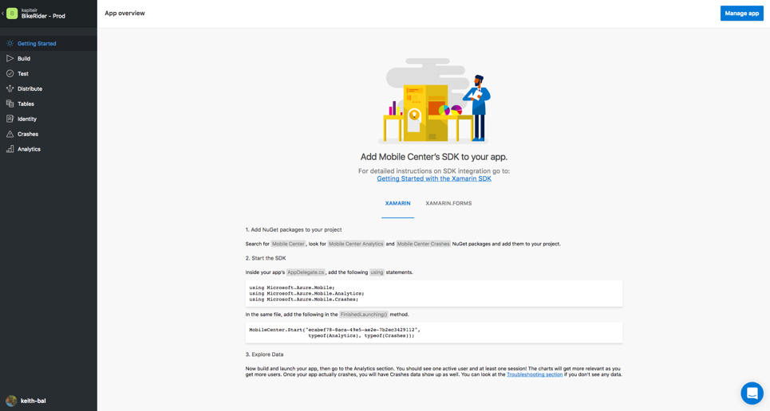
    
    >**Talking Point**: Let's have a look at a different version of the same app that has been used in production in the last few months and for which the SDK has been collecting data.

17. Click on **crashes**.
    
    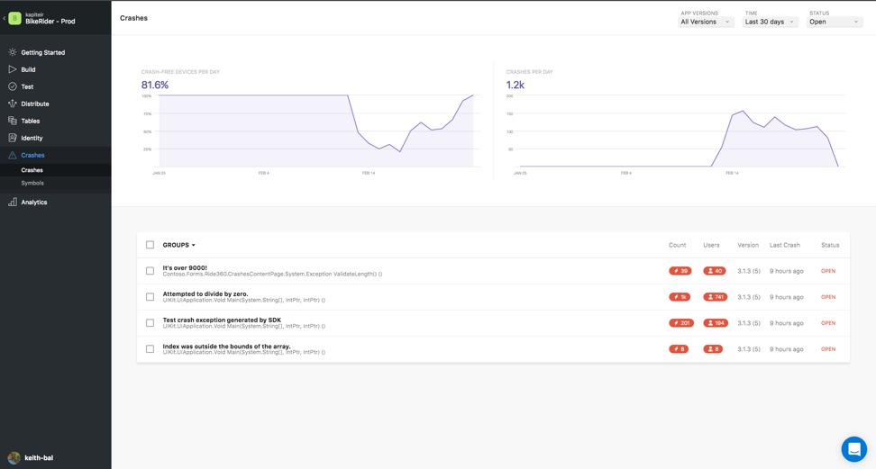
    
    >**Talking Point**: My app is doing pretty well - 96% of the users never experienced a crash. Unfortunately, there are still a few crashes that my users are facing. Mobile Center groups similar crash reports into crash groups, and makes it easy for developers to identify the most important issues.

18. Click on a **crash group**.

    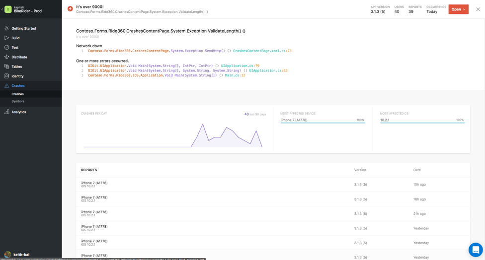
    
    >**Talking Point**: If I look into a crash group, I can see how many users were affected, on which devices and operating systems the crash happened, and even the detailed stack trace. As important as learning about the issues users are facing, is learning about how the app is being used.
  
19. Click on **analytics**.

    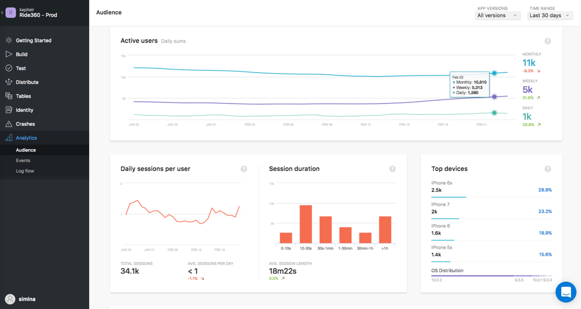
    
    >**Talking Point**: And here is where the analytics part of Mobile Center comes into play. I can see here how many people are using the BikeRider app, how often they use it – and for how long. When I look into the device section – seems like many of my users are using an iPhone 6S – and list of countries and on what languages they are using their phone.                                                                       
    
20. Click on **events**.

    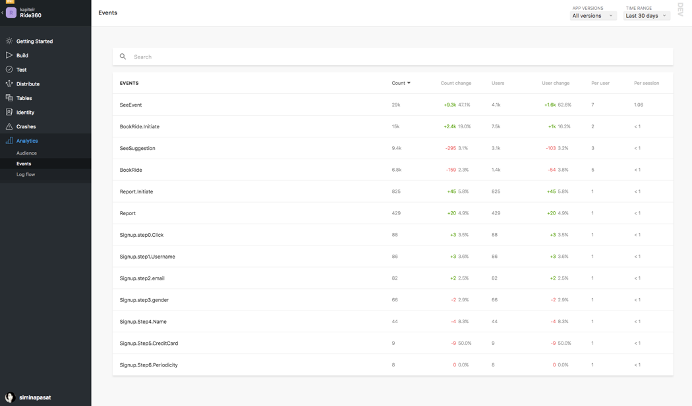
    
    >**Talking Point**: The SDK was also used to track events. Developers can find out how many people use a feature, how often, and even how the feature usage evolves over time.

21. Click on a **BookRide** event and scroll down to **properties**.

    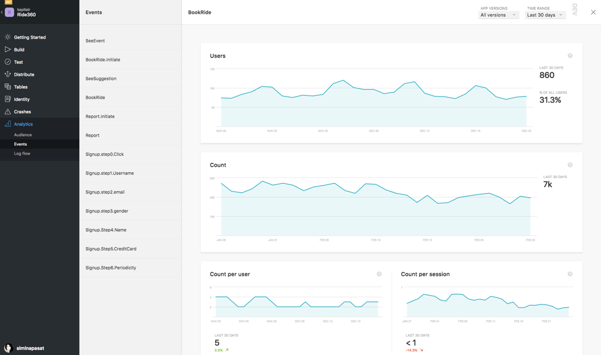

    >**Talking Point**: Let's look for instance into how people book rides – not only I can find out how the feature is being used and its growth, but if I dig into properties I can see that people don't use suggestions and the events feature as much as we expected when launching them. I love when I get all of these insights by adding only a few lines of code in the app.

22. Click on **tables**.

    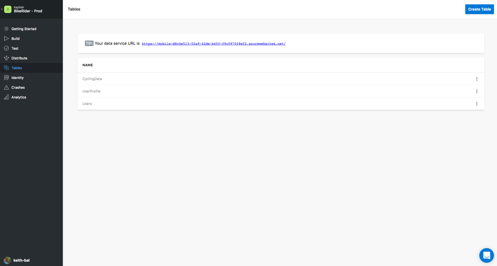

    >**Talking Point**: Finally, there’s one more part of Mobile Center I want to show you. Every great app needs a great backend. Azure provides a great backend with tons of customization options. For smaller apps and prototyping, the Tables and Identity services of Mobile Center give you easy access to Azure table storage and authentication.

    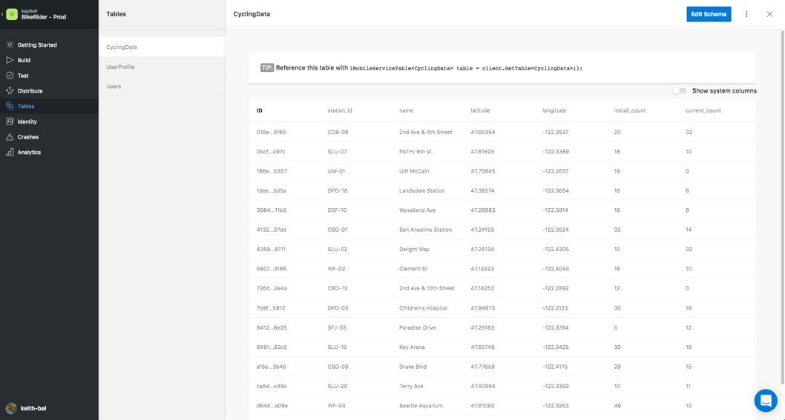

    >**Talking Point**: Let's have a look at how this would look like. I can see here in the tables section, a few tables for the bike rides and users – and how this table looks like. This makes it so easy to get started with your app's backend.
    Mobile Center brings to you – mobile developers – all the services you need to develop, ship and maintain beautiful mobile apps. You can now automatically build your app in our hosted cloud, run UI tests on real devices managed by us and distribute releases to your testers. To learn from your users, all you have to do is drop the Mobile Center SDK in your app. You can then learn about issues your users are facing and how exactly they are using your app when it is out in the wild. Mobile Center is Mission control for your mobile app – all you need in a single service.

## Old Demo (Connect 2016)

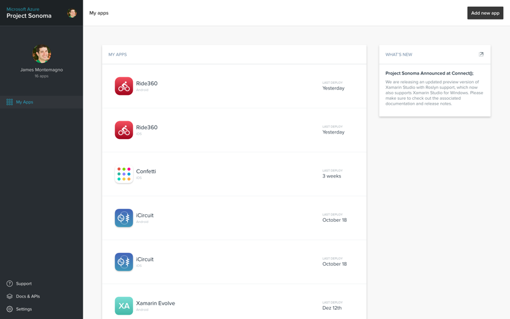

>**Talking Point**: Mobile Center is the mission control for mobile apps I’ve always wanted. It brings all of the mobile services I need together in one place. I’ll log in with my GitHub, and right away I see all of the apps I’m working on.

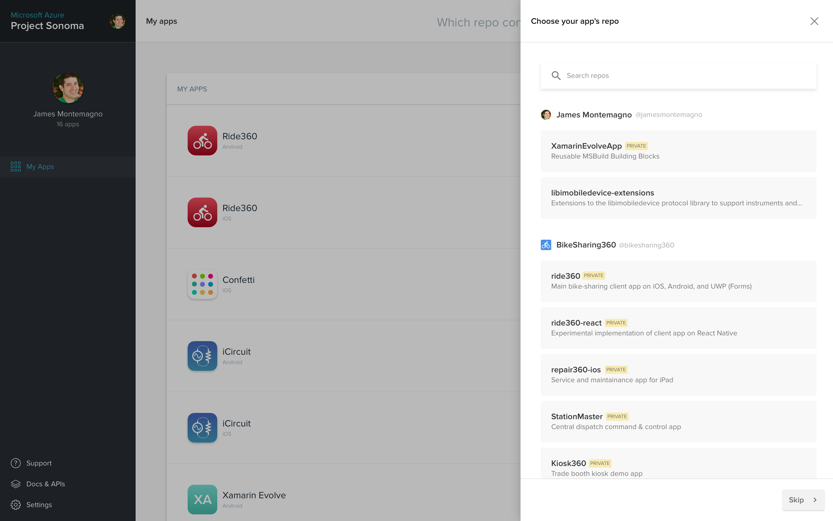

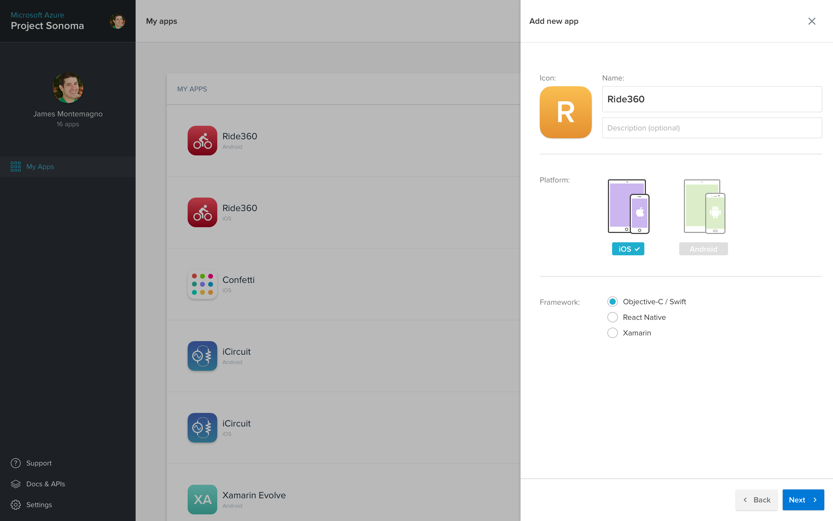

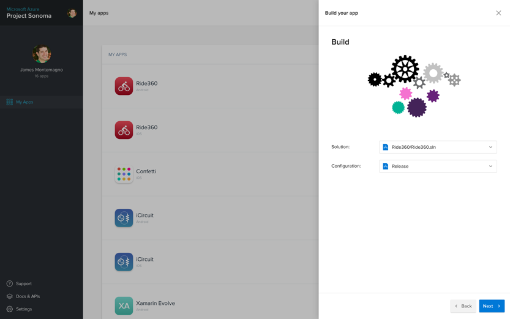

>**Talking Point**: Before jumping into a production app, let me show you how easy it is to get started with your own app. I logged in with GitHub, so I can quickly choose the repo that contains my app. In this case I’ll choose the Ride360 client app that you’ve seen today. I just need to tell Mobile Center that this is a Xamarin app.

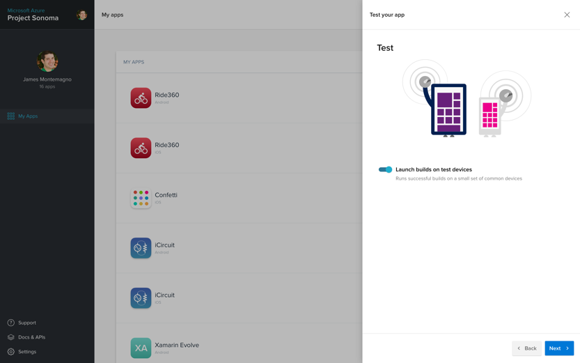

>**Talking Point**: I’m given the option to run the tests with Test Cloud, UI testing on real devices.

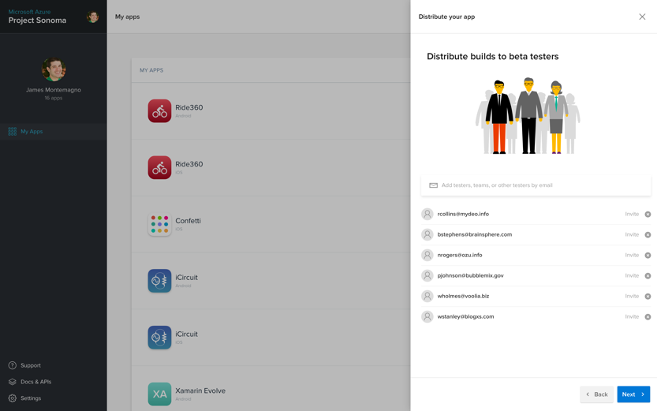

>**Talking Point**: Finally I can add some beta testers to receive builds of my app, let me add some of my collegues' emails.

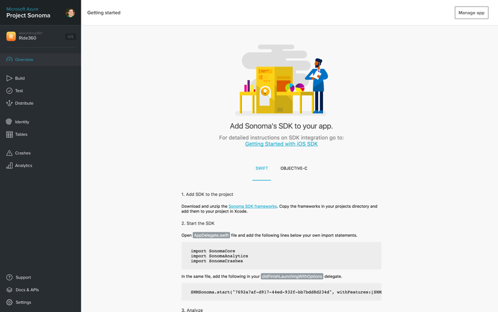

>**Talking Point**: Alright! We’ve connected to a repo and created an app. I see some easy getting started instructions for adding the Mobile Center SDK to my app, and inline C\# snippets for initialization. On the left, you see all of the services Mobile Center brings together. Let’s start with Build.

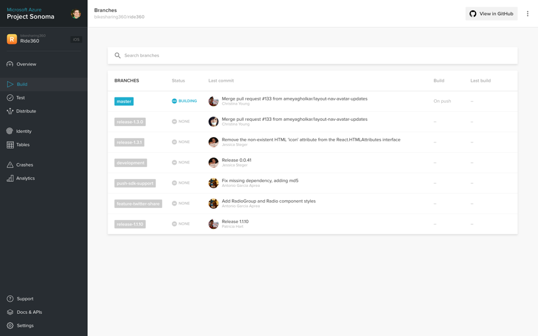

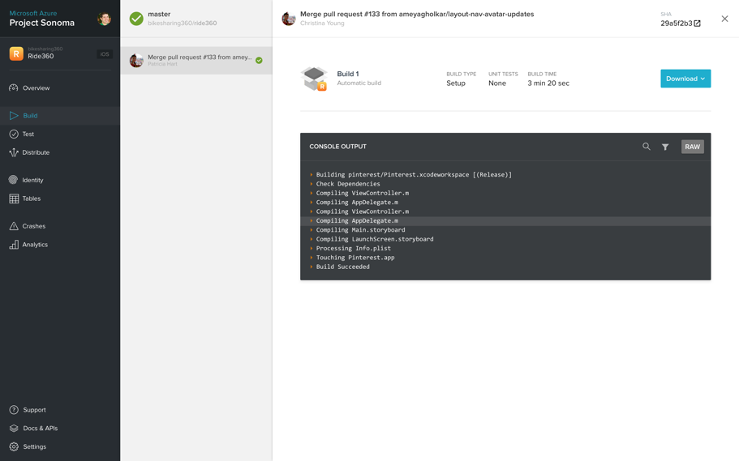

>**Talking Point**: Here are the branches in the repo I just connected, and we can see the master branch has its first build in progress. We’re getting live feedback as the build completes and BOOM, its done.

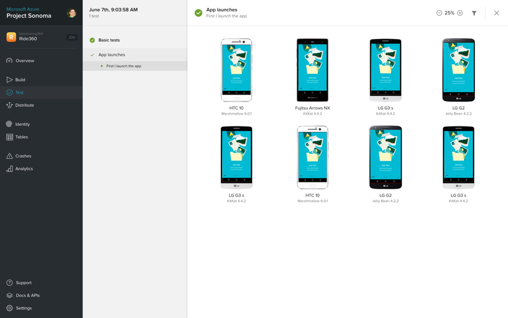

>**Talking Point**: Remember the tests we enabled when we connected this repo? This build is already being tested on real devices in the Test service. We can see that the simple test is already completed. It’s never been easier to start testing your apps on real devices.

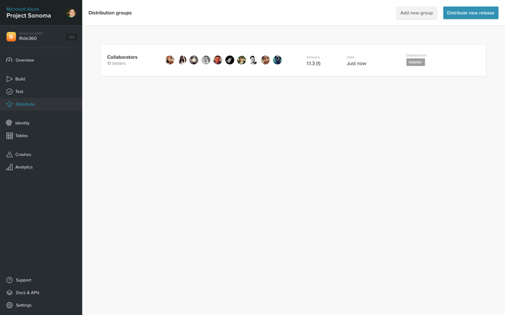

>**Talking Point**: Finally, let’s see the distribution service. Here are the collaborators I added when I created the app, and I can see they’ve been emailed a link to install the app we just built and tested. You can even see which commit triggered the distribution.

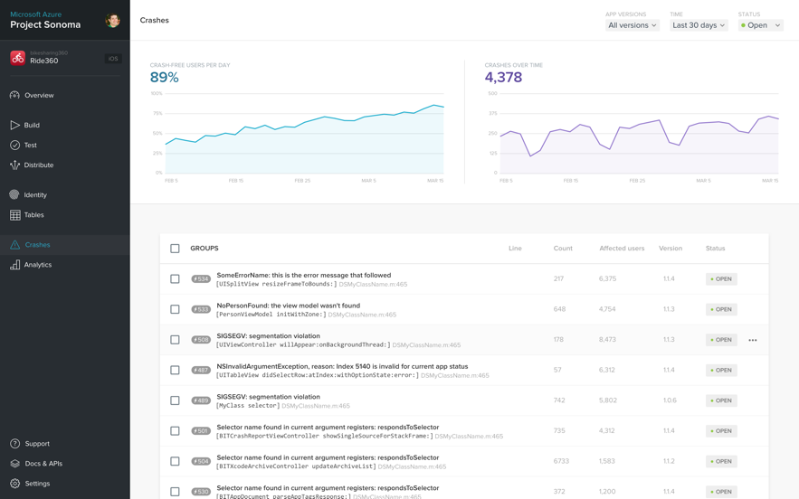

>**Talking Point**: To show you Crashes and Analytics, I’m going to switch tabs to a production app. These are the crash reports for the live Ride360 client app on iOS. Mobile Center has the amazing crash grouping and information that customers loved in Xamarin Insights and HockeyApp. Crashes are grouped by root cause so you can diagnose and resolve them quickly.

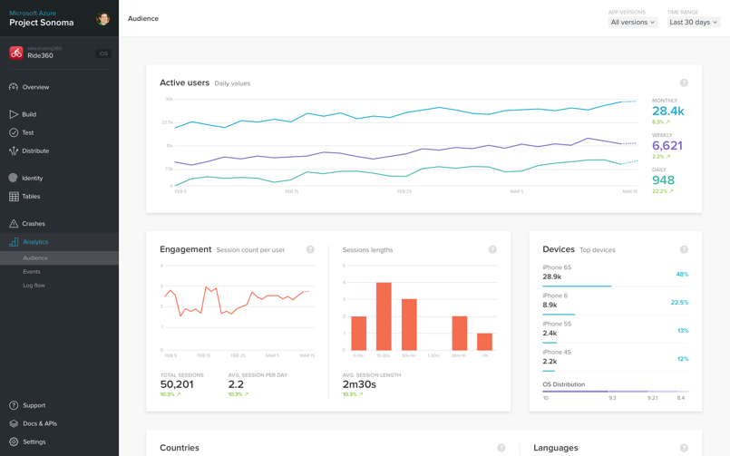

>**Talking Point**: Since we’re looking at a production app, we can see the developer-friendly analytics we collect merely by integrating the Mobile Center SDK.

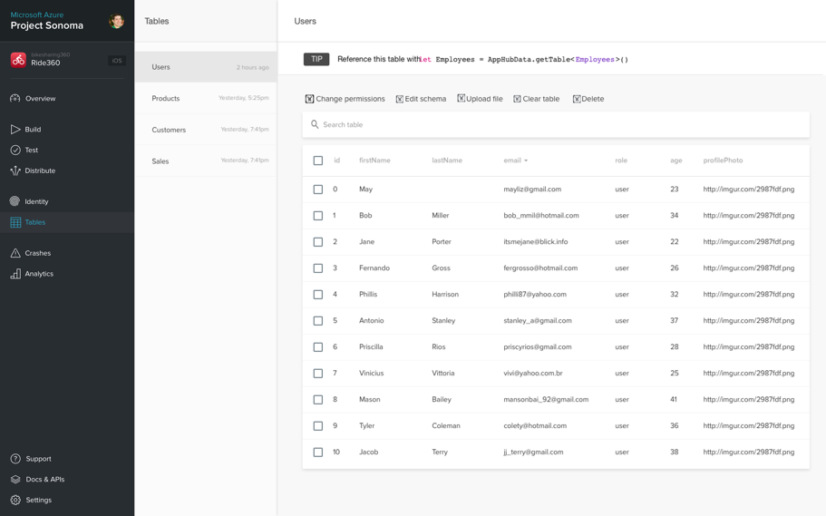

>**Talking Point**: Finally, there’s one more app service I want to show you. Every app needs a great backend, so Mobile Center makes connecting to the cloud easy as well. Our Table and Identity services give you easy access to Azure table storage and authentication. These are live tables powering our apps, and we can see as they are read and written to from clients. Mobile Center makes mobile devops more approachable than ever, and helps developers power their apps with Azure.

                                                                                                                                                                   