# Visual Studio and Xamarin

<p align="center">
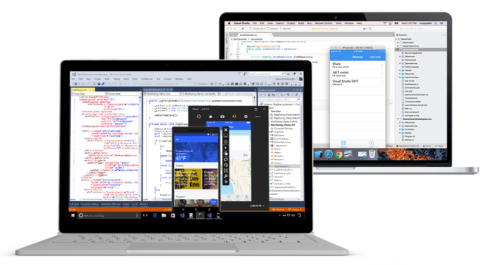
</p>

## Demo Pre-requisites

- Visual Studio 2017 RTM

- The following Visual Studio2017 workloads:

   - Universal Windows Platform development

   - Azure development

   - Mobile development with .NET

## Demo App Scenario Overview

**BikeSharing360** is an example of a smart bike sharing system with 10,000 bikes distributed in 650 stations located throughout New York City and Seattle. The company is getting positive attention from investors and is expanding to all major cities in the US very soon. This time developers in the company updated the Xamarin apps, so customers in Seattle can take advantage of this bike sharing program.

Their vision is to provide:

- A unique personal riding experience for people across generations 

- An intelligent platform to manage rental process, customer service, and bike maintenance

- A high-performance, reliable, and secure platform to provide integrated e-commerce services with partners

Bike Riders can download a cross-platform mobile app to:

- Find and rent bikes and manage your rides

- **My rides**: Discover and track your routes

- Get personalized recommendations for events & purchase what you need from your phone

- Issues on the road? Chat with **BikeSharing360** bot, your personal assistant on your phone and rental stations.

  

## Setup

1. Install Visual Studio 2017 Enterprise. Download <a href="https://www.visualstudio.com/downloads/" />from here</a>

2. During installation, be sure to select the following workloads:

   - Universal Windows Platform development

   - Azure development

   - Mobile development with .NET

   (The install may take as long as a few hours, depending on your internet connection and the speed of your computer. The total disk space required for the install will be about 40GB.)

   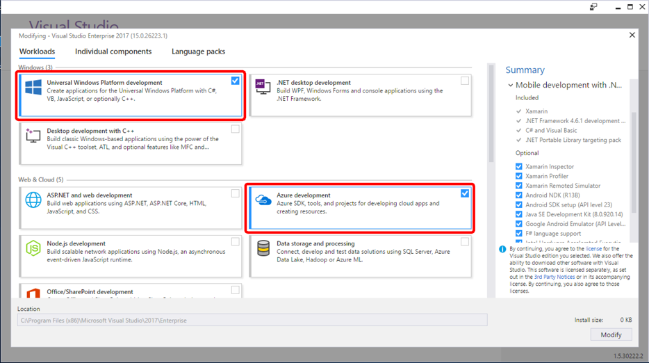

   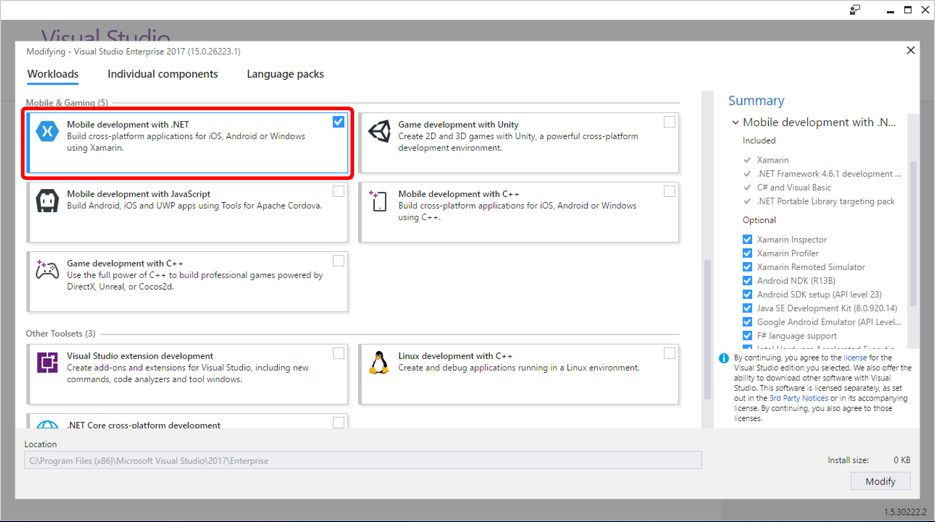

3. Install supplemental Xamarin Enterprise feature products:

   - <a href="https://www.xamarin.com/profiler" >Xamarin Profiler</a>

   - <a href="https://developer.xamarin.com/guides/cross-platform/inspector/install/#Download_and_Installation" >Xamarin Inspector</a>

   - <a href="https://www.xamarin.com/test-cloud/recorder" >Xamarin Test Recorder</a>
   
4. In some cases, the Java JDK may need to be updated. It's best to make sure that it is, and just manually do this yourself.

   a. Download and install the most recent version of the Java JDK. Take care to download the **64-bit version** if you're using a 64-bit machine: http://www.oracle.com/technetwork/java/javase/downloads/jdk8-downloads-2133151.html
   
   b. Locate the path to which it was installed on your filesystem. This is usually in either `C:\Program Files(x86)\Java\jdk1.8.0_121` for 32-bit versions of the JDK, or `C:\Program Files\Java\jdk1.8.0_121` for 64-bit. **Note that your folder will be slighly different depending on your version number.**
   
   c. In Visual Studio, select the **Tools -> Options** menu. 
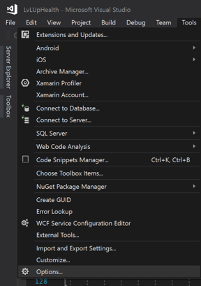
   
   d. In the Options window, scroll down to the **Xamarin** section and locate the **Java Development Kit Location**. Click the "Change" link. Enter the path you detemrined in step **b**, like `C:\Program Files\Java\jdk1.8.0_121`.
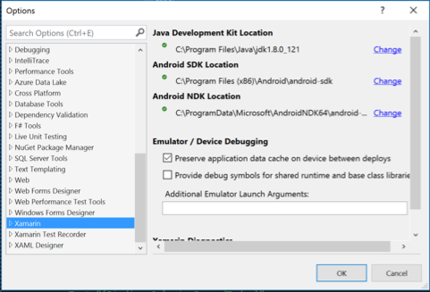
   
   e. Click "OK" and restart Visual Studio.

5. To show the iOS simulator for Visual Studio, you will need to have a Mac on your local area network to connect to. This can be a MacBook Pro or a Mac Mini. It can even be the MacBook Pro in which you are running a Windows virtual machine to do the Visual Studio portion of your demo.

   See document for guidance on iOS simulator / Mac Agent setup.

   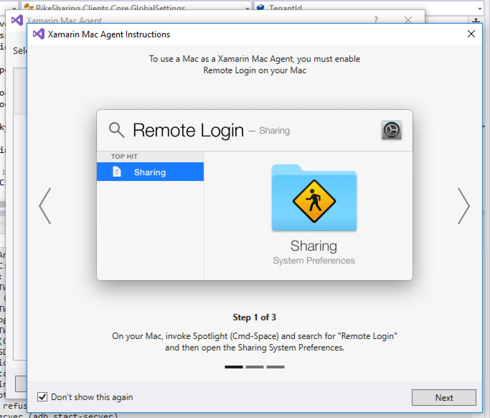

## Task 1: Open three Visual Studio 2017 instances

1. Open three instances of Visual Studio 2017. We will call these **instance 1, instance 2, and instance 3**.

   **Instance 1**: will be demonstrating the first half of **File | New** experience of creating an Azure-connected Xamarin Forms app, up until the actual solution creation action.

   **Instance 2**: will be demonstrating the last half of **File | New** experience of creating an Azure-connected Xamarin Forms app. This instance will be pre-prepared and connected to an Azure backend, so as to expedite the demo.

   **Instance 3**: will demo the Bike Riding app.

   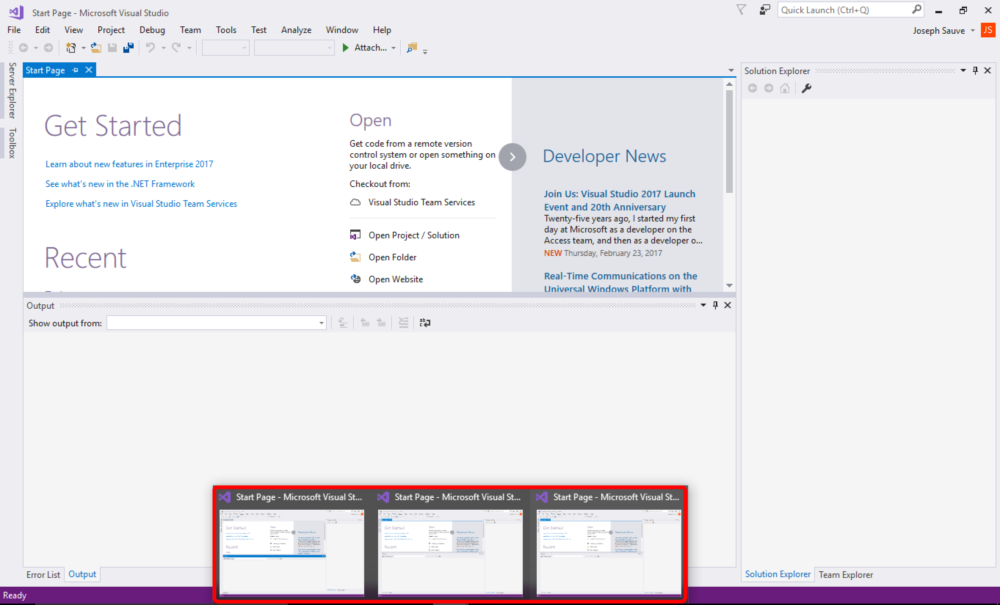

## Task 2: Setup Visual Studio instance 1

1. Switch to Visual Studio instance 1.

   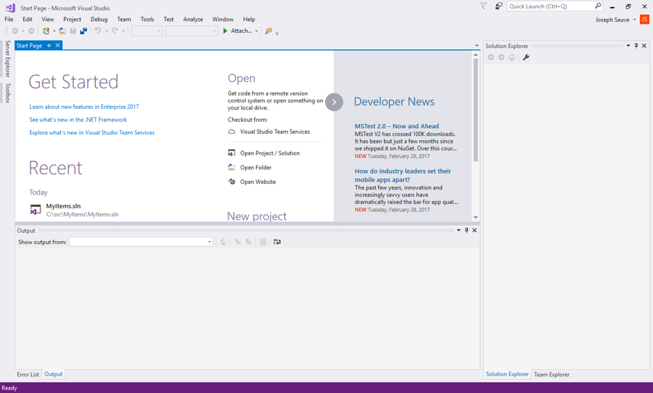

2. Select menu **File | New | Project**

   

3. Leave Visual Studio instance 1 in this state with the templates dialog presented.

   

## Task 3: Setup Visual Studio instance 2

1. Switch to Visual Studio instance 2. This instance will demo the new Forms app we started creating in Visual Studio instance 1. However, since the Xamarin Forms template + Azure wizard does not completely work as of RTM, some pre-setup is necessary in order to get a fully working syncing app. The app to use is called **MyItems**. It’s a simple app that performs syncing of simple data between devices and Azure App Service.

2. Click the Team Explorer tab in the right-hand pane. If you don’t see a Team Explorer tab, find it under **View** | **Team Explorer** in the menus.

   

   

3. Click the green connect icon at the top of the Team Explorer window (looks like an electrical plug).

   

4. With the Connect panel displayed, click **Clone** under the **Local Git Repositories** heading.

   

5. In the URL field, enter the MyItems app clone URL: https://github.com/Microsoft/VisualStudio2017-RTM-Xamarin-Cycle-9-Forms-Azure-Sample.git. Click **Clone** button and wait for cloning to complete.

   

6. You should now have the Bike Riding app source code cloned to your local machine.

7. If you’re not already on the Team Explorer tab, click it now.

   Double-click the **Visual Studio2017-RTM-Xamarin-Cycle-9-Forms-Azure-Sample** repo under **Local Git Repositories**.

   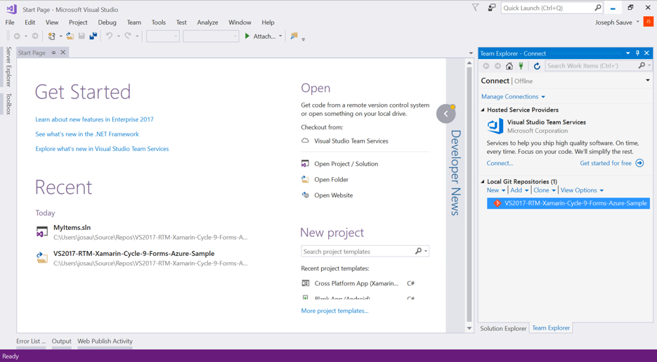

8. Click **Show Folder View** to reveal the solution files that are in the repo.

   

9. Find the MyItems.sln file in the solution list, and double-click it to open the solution. It may take some time to completely load the solution and all of its projects.

   

10. Now that you have the solution open and ready in Visual Studio, you need to setup an Azure instance and point the app at it. Follow the instructions here, and then return when you’re done. https://github.com/Microsoft/VisualStudio2017-RTM-Xamarin-Cycle-9-Forms-Azure-Sample

11. Right-click on the Android project, and select **Set as startup project**. Then start debugging on an Android emulator by clicking the Debug button in the toolbar.

12. Right-click on the UWP project, and select **Set as startup project**. Then start debugging on an Android emulator by clicking the Debug button in the toolbar.

13. Right-click on the iOS project, and select **Set as startup project**. Then start debugging on an Android emulator by clicking the Debug button in the toolbar.

14. The app is now installed on all of the emulators/simulators. Visual Studio instance 2 is now ready for demo.

## Task 4: Setup Visual Studio instance 3

1. If Bike Riding demo app source code has already been cloned, skip to step 7.

2. In instance 3, click the Team Explorer tab in the right-hand pane. 

   If you don’t see a Team Explorer tab, find it under **View** | **Team Explorer** in the menus.

   

   

3. Click the green connect icon at the top of the Team Explorer window (looks like an electrical plug).

   

4. With the Connect panel displayed, click **Clone** under the **Local Git Repositories** heading.

   

5. In the URL field, enter the Bike Riding app clone URL:
https://github.com/Microsoft/BikeSharing360_MobileApps

   Click **Clone** button and wait for cloning to complete.

   

6. You should now have the Bike Riding app source code cloned to your local machine.

7. If you’re not already on the Team Explorer tab, click it now. Double-click the **BikeSharing360** repo under **Local Git Repositories**.
   
   

8. Click **Show Folder View** to reveal the solution files that are in the repo.

   

9. Find the BikeSharing.Xamarin.sln file in the solution list, and double-click it to open the solution. It may take up to 30 seconds or more to completely load the solution and all of its projects.

   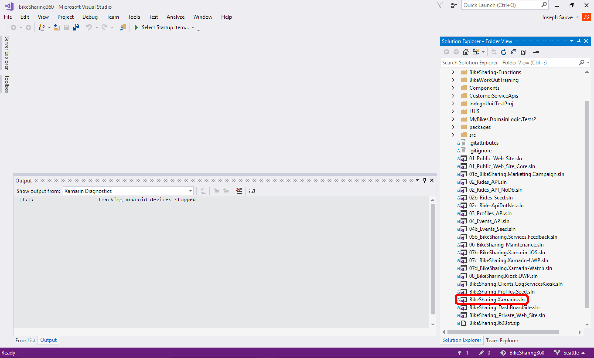


## Task 5: Setup Android Emulator

1. If you already have a working Android emulator installed, skip to step 5.

2. When you installed Visual Studio 2017 with the **Mobile development with .NET** workload, four Android emulators were installed. 

   To manage the Android emulators, click the **Android Emulator Manager** button at the top of Visual Studio. (The toolbar that contains this button will only be present when a Xamarin.Android project is loaded.)

   You may need to click the new icon that appears in the Windows taskbar. The emulator manager doesn't always take window focus on its own.

   

3. There are two types of emulators between the four: two that are ARM-based, and two that are x86-based. The x86-based ones are recommended because they can be accelerated by your Intel CPU.

   Select the one named **VisualStudio_android-23_x86_phone** (the important bit is that it's a phone emulator and it's x86). Click **Edit**. 

   In the edit screen, ensure that the CPU/ABI drop-down is set to **Google APIs Intel Atom (x86)**.

   The rest of the default settings should be fine. Click **Edit AVD** button to save the changes.

   

4. Ensure that the Windows 10 Device Guard feature is disabled. This feature prevents Windows from accessing the VT-x virtualization features of the Intel chipset. It is not usually enabled by default, but it is sometimes enabled in domain environments, such as at Microsoft.

   - Press the Windows key + R key to bring up the **Run** command window. 

   - Type **gpedit.msc**, and press enter key.

   - Navigate to **Local Computer policy** | **Administrative Templates** | **System** | **Device Guard**.

   - Right-click on **Turn On Virtualization Based Security**, and select **Edit**

   - From the presented radio buttons, select either **Not Configured** or **Disabled**.

   - Click **OK** button, then close the Local Policy Group Editor.

   

5. Back in the emulator manager, select the x86-based phone emulator again. Click the **Start** button to ensure that the emulator starts up.

   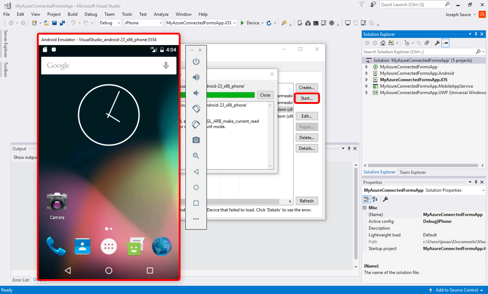

   

6. Now the emulator should have the apps from Visual Studio instance 1 (templated app) and Visual Studio instance 2 (Bike Riding app) on it.

   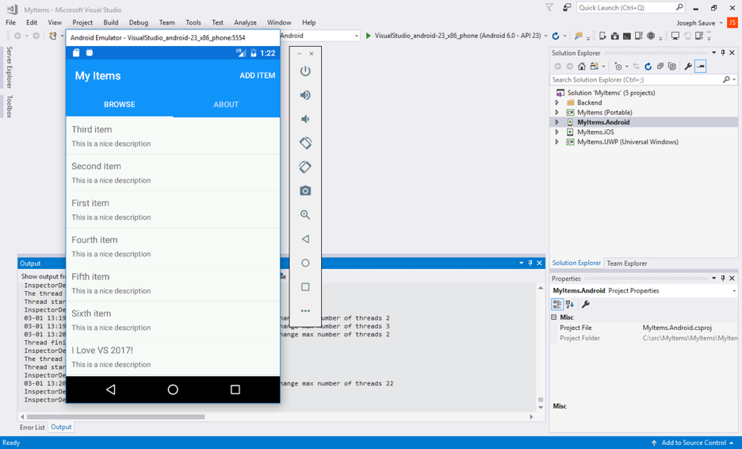

   

## Task 6: Setup iOS simulator for Visual Studio

1. Ensure that the Xamarin tools are installed on your Mac. This can be a separate Mac on your network, or if you're virtualizing Windows within a Mac, you can install the Xamarin tools on your hosting Mac. Reference link to <a href="https://www.xamarin.com/download" >download</a>

2. In one of your Visual Studio instances that has a Xamarin.iOS project open, click the **Xamarin Mac Agent** button in the toolbar.

   

3. If you intend to use a separate Mac on your network, you will need to specify which Mac to connect to.

   If you're using Windows as a virtual machine within your Mac, skip to step 4, but keep reading here regarding making the Mac available for building iOS apps.

   To make your Mac able to accept connections from Visual Studio and allow it to build iOS apps for you, you need to enable remote login on the Mac. Click the question mark button on the setup screen (Fig. A) to see the instructions for setting up Remote Login (Fib. B).

   

   

   Typically, the setup screen (Fig. A) will show all the Macs available on your network, but if you don't see your Mac, you can try adding it by its IP address (Fig. C).

   
   
   The easiest way to find the IP address of your Mac is to press the Command key + Space Bar, then type **network**. You should see a shortcut to the Network portion of the System Preferences that looks like Figure D. Press enter to open the network settings screen.

   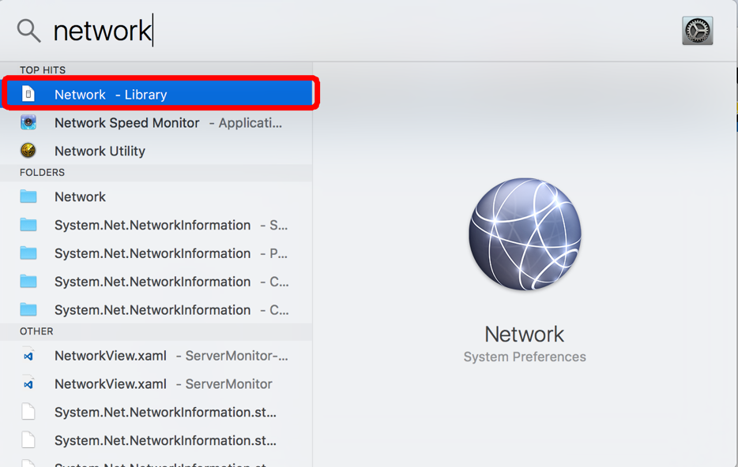

   In the network setting screen (Figure E), under the Status heading, note the IP address that is listed. This is the IP address that you will enter in the Mac Agent setup in Visual Studio. Enter it there, and then press enter.

   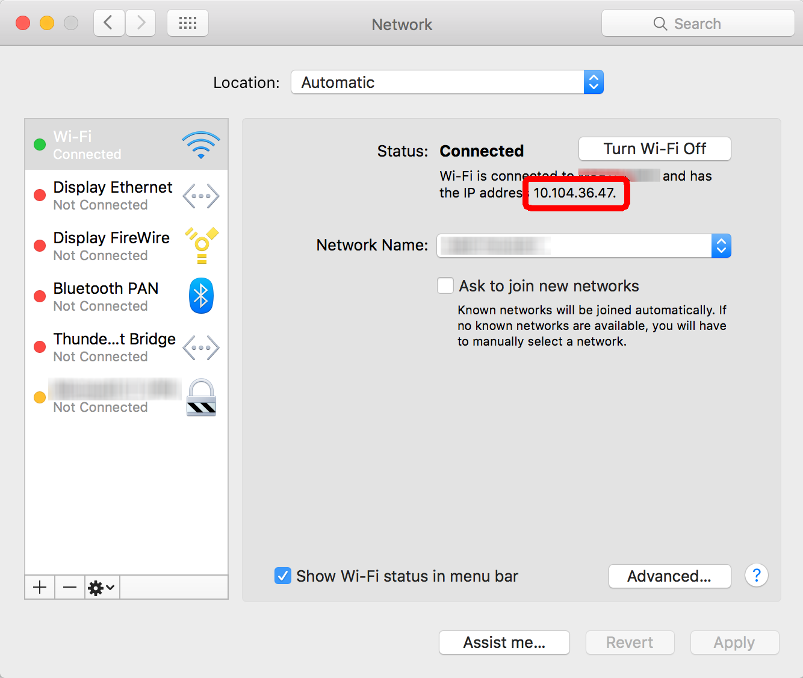

   You will then be presented with a username and password prompt (Fig. F). This is the username that you recently setup for Remote Login, and the accompanying Mac password for that account.

   

4. If you're using Visual Studio within a Windows VM on a Mac, and you'd like to use the host Mac as the build agent, follow these instructions. Otherwise, continue on. 

   The benefit of using a Mac to virtualize Windows is, of course, that you only need one computer for development instead of two.

   There are two ways to accomplish this. In most virtualization scenarios, there's a few different ways in which the network is configured between the host and guest operating systems. The most common are "NAT" (network address translation) and "Bridged Mode".

   In Bridged mode, both the host and guest are given IP addresses that correspond to whatever subnet the host is connected to. This means that both are **first-class** citizens on the network and can talk to each other through the network. The problem with this is that many public WiFi networks use a feature called **client isolation** which prevents connected devices from communicating with one another, for security reasons. In this case, the host and guest will be unable to talk with one another, despite the fact that they're sharing the same hardware.

   The other popular (and arguably more common) scenario is **NAT**, in which the host machine acts as a gateway for the guest, much like any modern router. This means that the guest is **behind** the host. Because of this, the client isolation of public WiFi networks is no longer a limitation. However, it is not as intuitive to find the IP address that you need to use.

   To find the IP address of the host Mac (Fig. A):

   - Press the Windows key + R key.

   - Type **cmd**, then press enter. 

   - Type **ipconfig**, then press enter.

   - Look for an entry that's something like **Ethernet adapter Ethernet0** or something similar.

   - Look for the line titled **IPV4 Address**, and note the IP address value.

   - We need to determine the gateway address. You may also see a line titled **Default Gateway**, but this is not the value we're looking for.

   - The IP address in step v has four parts, each separated by a dot. Replace the last part with a **1**. This is the address of your Mac host that Visual Studio needs to connect to.

   **Example:**

   If my IP address is 172.16.150.143, then the correct address that the Xamarin Mac Agent should use is 172.16.150.1

   You will need to follow the instructions in step 3, except that you now have the IP address that is necessary for connecting to your Mac host.

   

5. Once you have successfully connected a Mac agent, the setup screen will indicate the connection with a chain link symbol, and the Xamarin Mac Agent button in the toolbar will now be green.

   You are now ready to build iOS apps with Visual Studio. The iOS simulator for Visual Studio will launch when you debug iOS apps.

   

6. The iOS projects in Visual Studio instance 2 and Visual Studio instance 3 must have their supported architectures updated if you’re running on an x86 computer. In each solution:

   - Right-click the iOS project

   - Select **Properties**

   - Choose the **iOS Build** tab on the left from the list of vertical tabs

   - In the iOS Build panel, select the **Advanced** horizontal tab

   - Set the **Supported Architectures** setting to **i386 + x86_64**

   - Click File | Save or simply press Ctrl key + S key.

   - Close the iOS project settings

7. Now in Visual Studio instance 2 and Visual Studio instance 3:

   - Right-click the iOS project

   - Select **Set as Startup Project**

   - Select one of the iOS simulators from the device list in the toolbar.

   - Click the Debug button.

   Visual Studio will build the core app and supporting shared libs, send the app to the Mac Agent for packaging, start the iOS simulator, deploy the app to the simulator, and then attach the debugger to the app.

   You can close the app or stop debugging whenever you like.

   You will now have each app installed on the iOS simulator.

## Introduction to Xamarin

1. Present Visual Studio instance 1.

2. **File | New | Project** to present the templates dialog.

   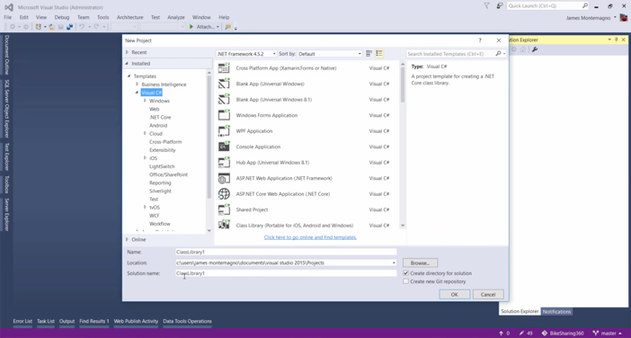

   >**Talking Point**: Hello! Welcome to this presentation on how to build cross-platform mobile apps with Xamarin! We’re going to look at how easy Microsoft has made it to create truly native cross-platform apps using Visual Studio and Xamarin. You’re going to see how easy it is to get started with building an app that runs across iOS, Android, and Windows platforms. We know we live in a mobile-first, cloud-first world, so we’ve worked hard to make it simple to start building cross-platform cloud-connected apps with mobile backends powered by Azure.

3. Highlight the Android, iOS, and tvOS templates while talking about them.

   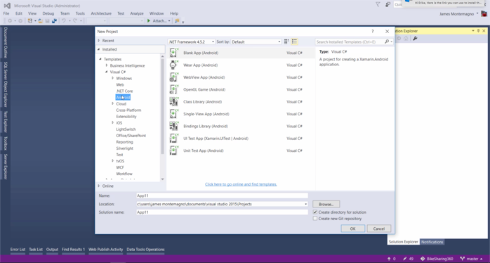

   >**Talking Point**: Here in Visual Studio, we have the project templates dialog that is familiar to any user of Visual Studio. When you install Xamarin for Visual Studio, you get a bunch of great mobile project templates to help get you started, such as Android app templates, iOS app templates, and even templates for Apple tvOS applications. If you’re building apps for each platform, these platform-specific templates are great for creating high-fidelity user interfaces, using SDK-native features such iOS storyboards or Android layouts.

## Importance of Cloud Connected Apps

1. Click on the Cross-platform templates node while starting to talk about Xamarin.Forms.

2. Select the template titled **Cross Platform App (Xamarin.Forms or Native)**

3. Optional: adjust the project path if you’d like.

4. Click **OK** button.

   

   >**Talking Point**: But if you’re instead taking advantage of the Xamarin Forms framework, we also have templates that take advantage of that unique and powerful API for creating fully native cross-platform UIs. We’re going to use that Xamarin Forms template in this demonstration right now. You can see here that we have templates for Cross-Platform apps, and it’s simply a click to get started. 

5. Click between the Blank app and Master-Detail templates, and Make the Master Detail template the one that you finally select.

6. Click back and forth between the UI Technology options, finally selecting **Xamarin Forms**.

7. Click back and forth between the Code Sharing options, finally selecting **Shared Projects**.

8. Select the **Host in the Cloud** checkbox.

9. Click **OK** button

   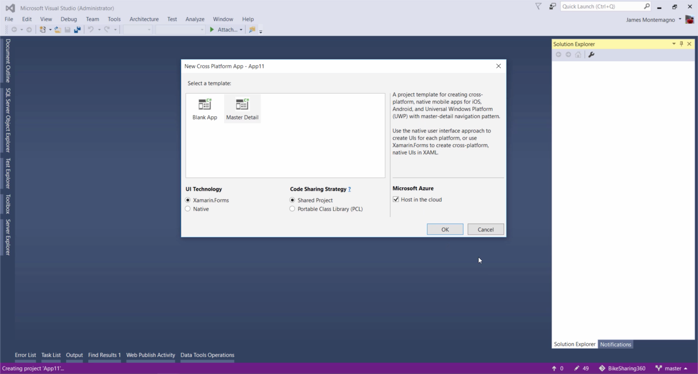

   >**Talking Point**: The next thing we see is some options about how we’d like to organize our cross-platform app. We have a choice of a Blank App or a Master-Detail application. The difference is that one starts with a single app screen, and the other is setup to have a list of data with a detail screen for each. The UI Technology options present us with a choice between Xamarin Forms and Native. As I alluded to before, the native option will allow to use the full expressive native UI APIs of each platform, whereas Forms can get you up and running much quicker but also allow a great degree of customization. We’re choosing Xamarin Forms. The Code Sharing Strategy option lets us choose how to structure the actual architecture of our app. Shared Projects essentially share source code between projects, essentially re-compiling the shared code for each platform. Portable Class Libraries compile the shared code into a single common library that can be used by any of the platforms. We’re choosing Shared Project for our demo today. And finally, when we select Master Detail as our template, we’re given the option to “Host in the Cloud”, which will create an Azure backend service and connect our app to it. This will build out a full Master Detail app, with all the necessary navigation, scaffolding, and spin up and connect an Azure backend. Very cool!

10. No need to click on anything on this screen; as long as you're logged into Visual Studio with your Microsoft account and you've setup an Azure account, the drop-downs should auto-populate.

11. Do not click the **Create** button, since we'll be switching over to Visual Studio instance 2.

    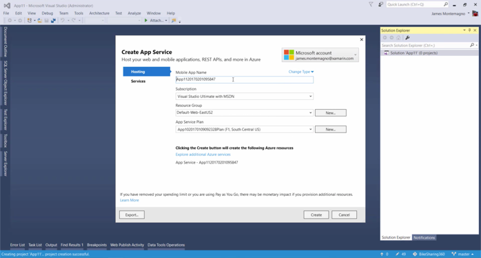

    >**Talking Point**: Now we simply click “OK”, and we’re presented with a dialog that gives us some options for our Azure backend. It’ll automatically connect to my Azure account and pre-populate with my subscription information. Here we can give our backend service a name, assign it to a resource group, and associate it with my Azure plan. Then we just click “Create” and it will automatically spin deploy the backend, scaffold the cross-platform app code, and configure it to connect to the newly created Azure service.

12. Switch to Visual Studio instance 2.

    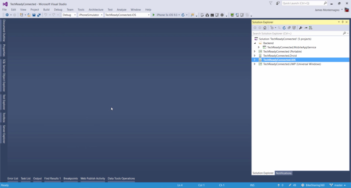

    >**Talking Point**: Now, in the interest of time, I’ve already created my service and allowed Visual Studio to scaffold the app ahead of time. It takes about 30-60 seconds for all the provisioning, so I’ve saved us the time of having to wait.

13. Click through the projects, expanding them as you talk about them. 

    

    >**Talking Point**: This Visual Studio solution is the result of the template we chose, and is a fully scaffolded cross-platform Xamarin app targeting Android, iOS, and UWP. We also have a project for our backend Azure App service, which is a complete ASP.NET application, complete with controllers, models, and data objects. And it’s completely configured to deploy to our Azure App service subscription which has already been provisioned in the cloud.

14. Click on the core Xamarin Forms projects (marked as **portable**).

15. Expand the folders within the project as you talk about them.

16. Click on the iOS, Android, and UWP projects as you talk about them.

    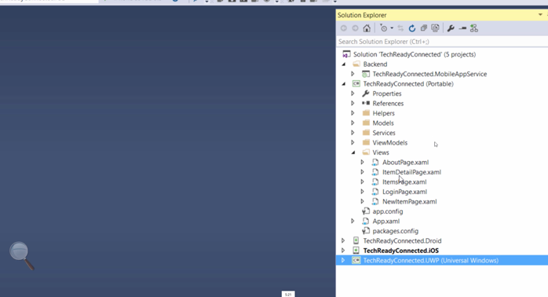

    >**Talking Point**: In a Xamarin Forms app, the bulk of the application lives inside this shared project. This is where application logic, models, viewmodels, and even our user interface is defined. The other platform projects for Android, iOS, and UWP are essentially like boot-strappers for starting up the shared Xamarin Forms app, as well as allowing for platform-specific code to implemented if necessary. 

17. Open the **ItemsPage.xaml** under the **Views** folder of the core Xamarin Forms project.

18. Highlight a section of code that shows data binding, as in the screenshot.

    

    >**Talking Point**: Because we chose the Master Detail template, a bunch of pre-made app views have been setup for us, like this one here, which is a list that allows a user to add, edit, and delete items. And the way that UI is defined can be seen here as XAML, which is a markup language used for declarative defining user interfaces. XAML is familiar to WPF and UWP developers, and is very well-suited to the Xamarin Forms goal of cross-platform UIs. In this list view, the binding to the data has already been taken care of for me, and thanks to the Azure App Service SDK in this app, the data will sync back and forth with my Azure backend automatically.

19. Start up the app in the UWP mobile emulator.

20.	Present the Android emulator and startup the app, which you should have already deployed to the emulator before the demo.

21.	Tap on any one of the list items in the UWP version of the app.

22.	Edit that item by changing its name and description. Click Save.

23.	In the Android emulator, execute a pull-to-refresh gesture to sync the changes that you just made, i.e. to pull them from Azure into the Android app.

    

    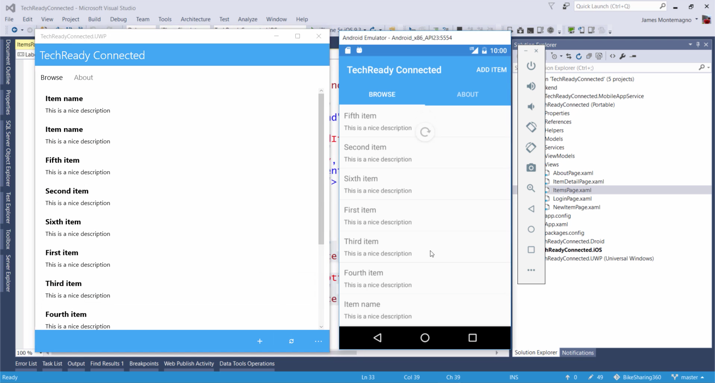

    

    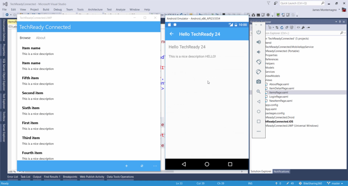

    >**Talking Point**: Let’s go ahead and run this app so we can see what it looks like. We’re going to run it on two platforms: on an Android emulator and as a Windows UWP application. As you can see, this app allows you to browse data in a tabbed navigation system. In this case, we have a Browse tab and an About tab. All the data we see in the list is actually provided from our Azure backend service, and synced locally with our app. To demonstrate this, I’ll tap on an item in UWP, update its title and description, and then click the save button. Then in the Android emulator, I’ll perform a pull-to-refresh action and voila! The change we applied to our data in one instance of the app immediately appears in another instance of the app, thanks to the syncing capabilities of the Azure App Service backend and accompanying SDK in the mobile app code.

24. Switch to a web browser and present the dashboard for the Azure App service backend.

25.	No clicking necessary, just present this screen while talking about Azure App service and syncing.

    

    >**Talking Point**: This incredibly powerful sync feature is all powered by the Azure App service backend project in our solution that we pushed out to our Azure App service subscription running in the cloud. Here in the Azure portal dashboard, we can see the requests coming in from our app, as well diagnostic info. And of course, since we have all the code for this service, we can add whatever new functionality to it that we like and re-deploy it in a matter of seconds. The beauty of using the template to get up and running with Xamarin and Azure is that we have ALL of the code for our app and backend in a SINGLE Visual Studio solution. Amazing!

26. Switch back to Visual Studio instance 3.

27.	Right-click the iOS project and set it as the Startup project.

28.	Choose an iOS simulator from the available debug devices at the top of Visual Studio.

29.	Click the Debug button to build and deploy the app and have it appear in the iOS simulator for Visual Studio.

30.	Edit some data in the iOS simulator and then do the pull-to-refresh again in Android to demonstrate the data is syncing.

    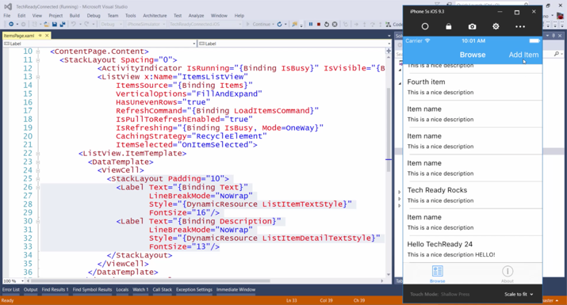

    

    >**Talking Point**: But when we go back to our desktop development environment, we may notice that something is missing. We have our Windows application, our Android app but it would be really great if we had an iOS app as well. Here we can see the iOS project in our Visual Studio solution, and we even have iOS simulators listed at the top of the screen. All we need to do is hit Debug, and Visual Studio will automatically connect to my Mac, start up the iOS simulator, deploy my app to it, and start a debugging session. This happens with the remote iOS simulator for Visual Studio, allowing us to run and debug iOS apps without having to leave the comfort of Windows. And just as before, we edit data in this simulator, save the changes, and see that synced data reflected in our other platforms.

## Demo Designer with Forms Previewer

1. Switch back to Visual Studio instance 3.

2. Start up Forms Previewer after talking about it. Select menu **View | Other Windows | Forms Previewer**.

   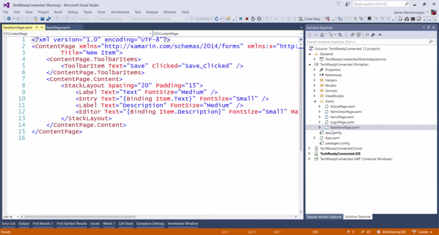

   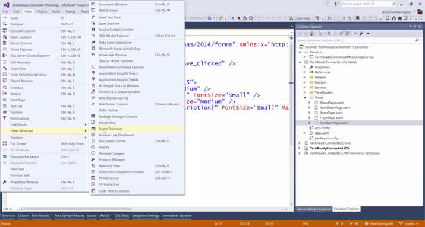

3. Select the file **NewItemPage.xaml** and open it.

   

4. Under the **ContentPage.Content**, type

   ``` 
   <Switch IsToggled="True" />
   ```

   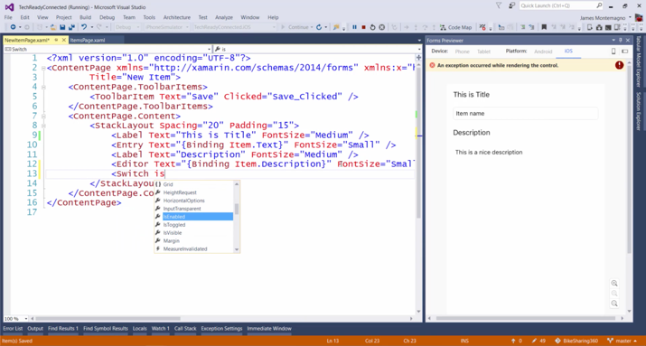

   

   Now, include the following code to see the toggle button move towards the center of the screen

   ``` 
   <Switch IsToggled="True" HorizontalOptions="Center"/>
   ``` 

   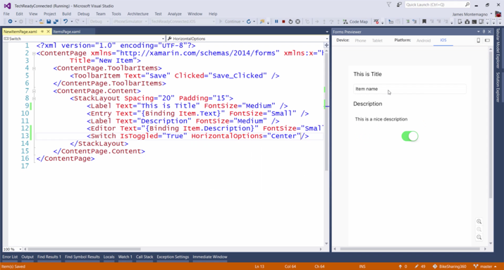

   >**Talking Point**: So, this is all really great, right? We have a cross-platform UI…we have an automatically syncing Azure backend…we have the ability to debug all our platforms, even iOS. And we have all this great XAML code that was automatically generated for us by the template. But wouldn’t it be really great if we could see our code changes LIVE, as we make them, instead of having to repeatedly code, compile, and debug??? Well the great news is that we CAN. With Xamarin Forms Previewer, we get to see what our UI will look like AS we’re coding it, saving us enormous amounts of precious time by not coding, compiling, and debugging. We can even switch between iOS and Android to preview what our changes will look like on each platform. So as you can see, as I’m changing things in code, those changes are happening LIVE in the Forms Previewer. Let’s add a control to this Item Detail screen to see it appear right before our eyes, without any compilation or debugging. We can even adjust the horizontal alignment of this and see it change in real-time. Any property that we can think of can be adjusted and we can see the results immediately.

## Highlight Inspector

1. Set **MyItems.Android** as the startup project.

2. Deploy it to Android Simulator.

3. Once the application is deployed to the simulator, click the **Add Item** button on the top right of the simulator.

4. Now that I dont like the "Title" of the screen, I want to change it. So, click on the **Live Inspect** button next to the debugging controls.

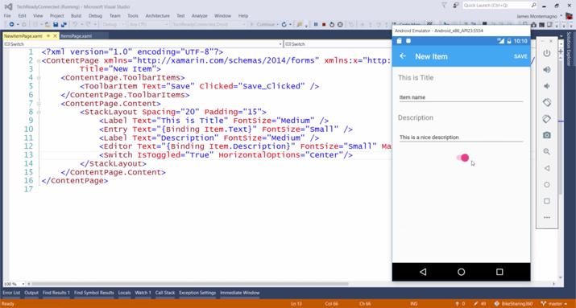

5. It launches the Live Xamarin Inspector which creates a live session connected to the Android emulator.


6. You can visualize the application live on the inspector screen which gives a full layout of the app.

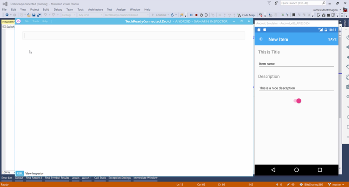

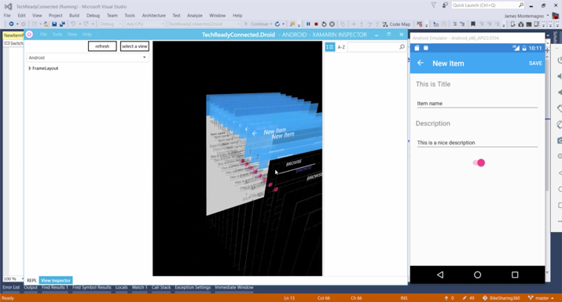

7. Choose the **Xamarin Forms** from the drop down within the Inspector window which gives the compressed layout view.


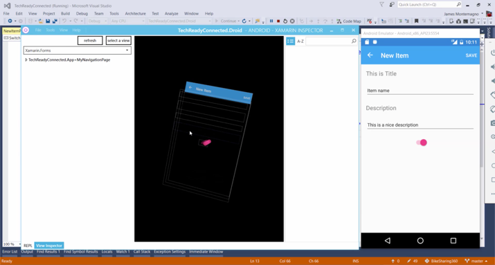

8. The app background looks black but its actually transparent. So, Expand the **TechReadyConnectedApp** and tap on the StackLayout which results in a Property Grid.


9. Modify the sliders in the "Background" section to check out different colors for the app background within the emulator and click on **Refresh** to view the change live on the emulator.

All this done without having to stop the debugging of the application!


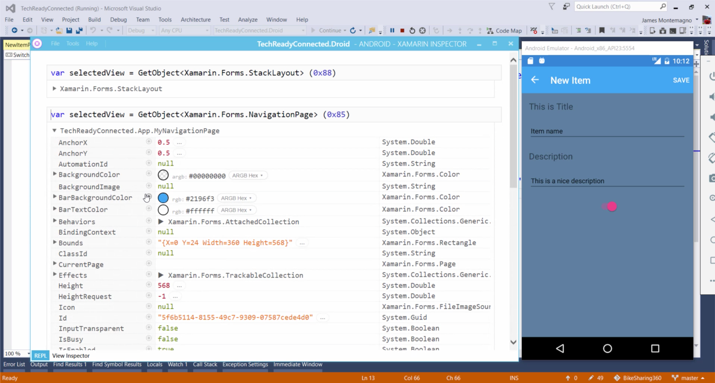

>**Talking Point**: Then we can fire up this in our Android emulator and see these changes running in a compiled version of the app. But what if we don’t like how this looks and want to try something else. We could stop the emulator and go back to the Forms Previewer. Or we can use Xamarin Inspector to try out changes to our live running app running on the emulator. In my toolbar at the top of Visual Studio, I have an **inspect** button, which will open Xamarin Inspector when clicked. With any iOS or Android app, it gives me a way to interact with and modify my app on-the-fly while it’s running. To demonstrate, we can see that there’s a full REPL available (Read Evaluate Print Loop). So, I can start typing code, just as I would in the Visual Studio IDE and have full Intellisense to the available APIs. OR, we can go into a visual inspection mode, which will give me a full 3D rendering of the entire app, showing all the visual layers that the native SDK UI APIs are currently rendering. We can rotate and zoom this view to get a sense of how much is going on in the UI of a typical app. Now, since there’s a lot going on here and we’re really just interested in the Xamarin Forms APIs of this particular app, we can switch into a Xamarin Forms view mode which will condense the 3D view to contain only those UI elements. You can see that it’s much simpler and more representative of what our Xamarin Forms APIs are doing. If we want to inspect and modify individual UI elements of our app, we can drill through the view hierarchy until we find the StackLayout, which is the parent UI element of all our labels and other controls in this view. When we select it, we can see that the properties section of Inspector displays all the attributes of the StackLayout. If, for example, I wanted to modify the background color, I can do that right here within the BackgroundColor property, and we’ll see the color of the app change instantly in real-time! This is another amazing feature, that allows us to quickly iterate on design, avoiding the traditional time-consuming process of coding, compiling, and debugging. In addition, I can go back to the REPL screen and see the code for all the properties that are being selected and modified, so that I can simply copy and paste back into my app’s code to make those changes permanent.


## Showing the Bike Riding App

1. Open the **BikeSharingApp**


>**Talking Point**: Everything we’ve demoed so far has been pretty amazing. We’ve been able to quickly setup a cloud-connected app, deploy an Azure backend service, take advantage of data synchronization across multiple platforms, and use tools to make some of the most rigorous of development tasks seem effortless.


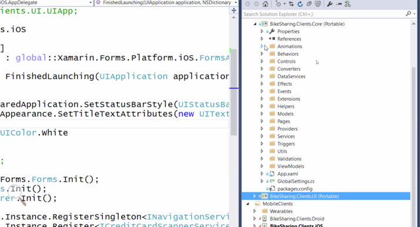

>**Talking Point**: But now what we’re going to look at is a fully-fleshed out Xamarin application called Bike Sharing. This is a Xamarin Forms app, but instead of being just a File-New app like we just went through, this is a fully baked ready-to-deploy grade app. It’s open source on Github, so you can go grab the code and learn how it works. It combines several Azure backend services, including ASP.NET and .NET Core. In the Xamarin portion of the app, over 90% of the app code is shared between platforms: Android, iOS, and Windows.

2. Launch the app on Windows and Android emulator, click on **New Ride** in the respective screens.

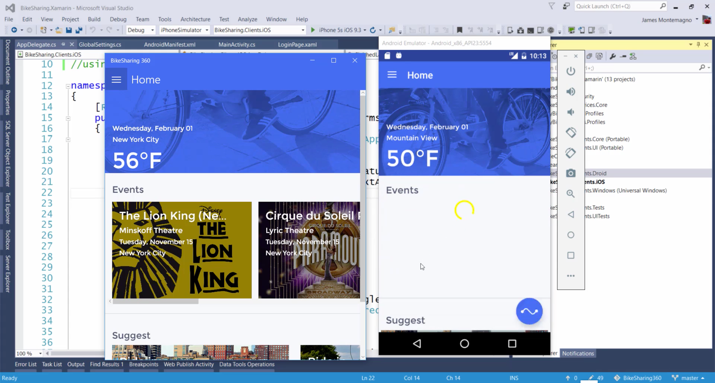

3. Enter the **From** and **To** points in the app or choose the place of your choice on the screen.


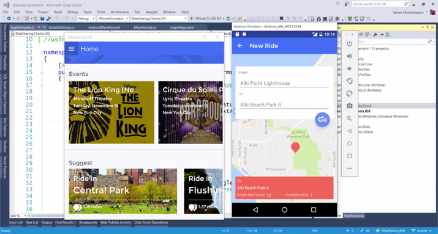

4. Click on **Go** to see the booking confirmation page. Click on **Booking Bike** button to get a confirmation page.

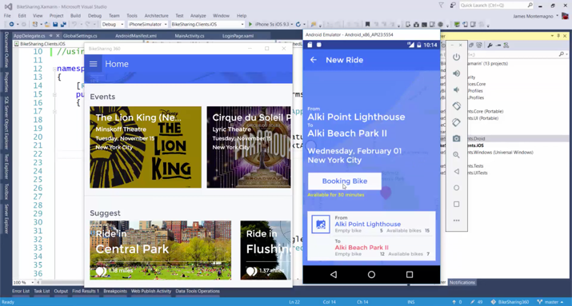

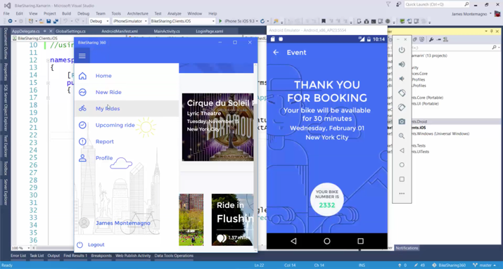


>**Talking Point**: So, let’s spin it up on the different platforms and take a look. The premise is that it’s a Bike Sharing app that allows people share and ride bikes all across a city. You can see here on this main screen, it’s pulling in a live data feed of weather as well as suggested activities based on the user’s location. It also gives me suggested routes that I may want to take. The main action in the app is to start a new ride, which will display a map of my general location and present an overlay for choosing my starting point and destination. I’ll choose a destination and tap **Go**, which presents a summary of my ride plan and a call to action that allows me to book the book for riding. Once I’ve booked, I get a confirmation and a bike number. And of course, since this is all synced via our Azure backend, this booking will be synced to all my devices. So, as you can see, this is a beautiful app, sharing over 90% of its code between platforms, and demonstrates how Xamarin, Azure, and Visual Studio all come together to create robust, compelling, and engaging apps.
